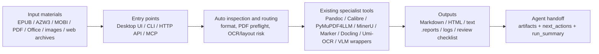
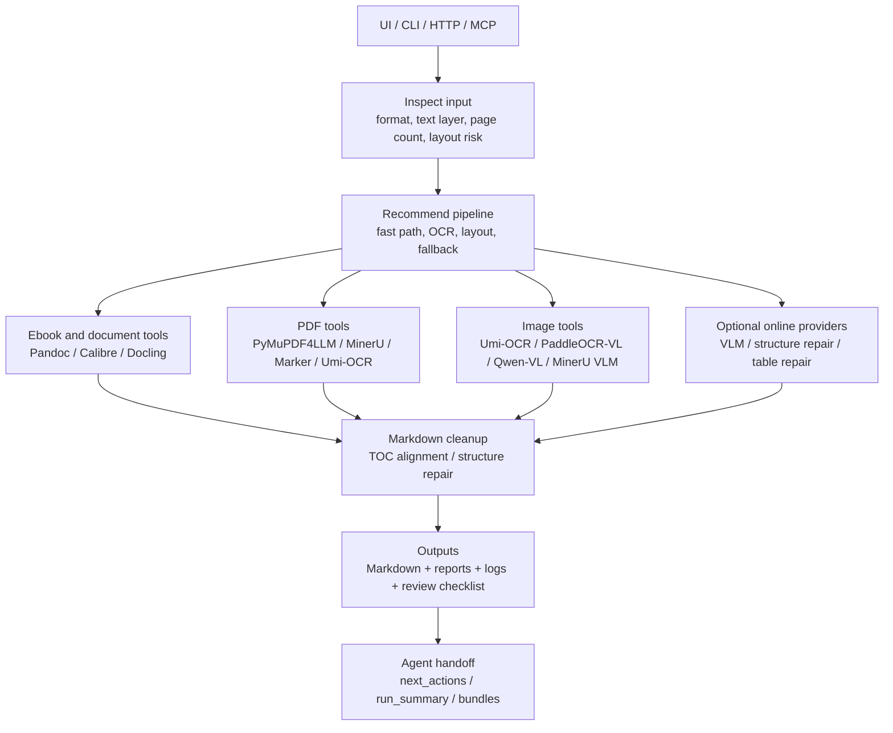

# 图文材料转换器

Graphic-Text Material Converter is a local-first converter for ebooks, PDFs, Office documents, screenshots, image sets, and web archives. It turns mixed graphic/text materials into Markdown and reviewable artifacts, with automatic routing, fallback, quality reports, and agent-friendly APIs.

Stable internal id: `ebook-markdown-pipeline`. The Python package is still `ebook_markdown_pipeline` for compatibility with existing MCP, HTTP, CLI, Docker, and script integrations.

Start with [docs/PROJECT_OVERVIEW.md](docs/PROJECT_OVERVIEW.md) for the public-facing project summary, GitHub About text, architecture diagram, and reuse boundary. Installation steps are in [docs/INSTALLATION.md](docs/INSTALLATION.md). A shareable architecture diagram is in [docs/ARCHITECTURE_DIAGRAM.md](docs/ARCHITECTURE_DIAGRAM.md), while full architecture diagrams and module boundaries are documented in [docs/ARCHITECTURE.md](docs/ARCHITECTURE.md). Third-party tools, reuse boundaries, and license notes are listed in [THIRD_PARTY_NOTICES.md](THIRD_PARTY_NOTICES.md) and [docs/REFERENCES_AND_REUSE.md](docs/REFERENCES_AND_REUSE.md).

Current development roadmap: [docs/plans/2026-06-11-next-stage-development-plan.md](docs/plans/2026-06-11-next-stage-development-plan.md).

## Quick Flow



## Architecture At A Glance

The repository is intentionally a coordinator, not a new parser/OCR/model stack. UI, CLI, HTTP, and MCP all enter the same routing layer; that layer inspects inputs, chooses specialist tools, normalizes Markdown, records quality evidence, and returns artifacts plus agent-safe next actions.



For the full architecture, PDF/image routing diagram, module map, and third-party boundary, see [docs/ARCHITECTURE.md](docs/ARCHITECTURE.md).

For a single-page shareable architecture map, see [docs/ARCHITECTURE_DIAGRAM.md](docs/ARCHITECTURE_DIAGRAM.md).

For a concise repository overview that can be shared with new users or agents, see [docs/PROJECT_OVERVIEW.md](docs/PROJECT_OVERVIEW.md).

## Highlights

- Converts `EPUB / AZW3 / MOBI / FB2 / TXT / RTF / ODT / PDF / DOCX / PPTX / XLSX / HTML / CSV / images` to Markdown-oriented outputs.
- Routes work across existing tools instead of reinventing parsers: Pandoc, Calibre, PyMuPDF4LLM, MinerU, Marker, Docling, Umi-OCR, PaddleOCR-VL, and Qwen-VL wrappers.
- Detects long PDFs, scanned PDFs, complex layouts, PPT-exported slide PDFs, and weak text layers before choosing a pipeline.
- Builds quality reports under `.reports/`, including summary, review checklist, PDF tool logs, fallback diagnostics, and structure repair evidence.
- Explains structure repair decisions with action, confidence, reason, signals, and inferred outline in per-book reports.
- Rebuilds screenshot/image books from unordered, duplicate, or partially overlapping screenshots.
- Builds a lightweight page/image location index when you only need to know which PDF page or image contains a keyword.
- Exposes the same core workflow through UI, CLI, MCP, and HTTP for OpenClaw, Hermes Agent, Codex, or other automation agents.
- Keeps third-party projects at the tool/API boundary: this repository provides orchestration, routing, UI, reports, recovery, and agent contracts rather than vendoring parser/OCR/model code.

## Referenced And Reused Tools

This project follows a tool-first integration principle: use mature tools directly, and write only the glue needed to make them reliable together. The main directly integrated tools are:

| Tool | Role |
| --- | --- |
| Pandoc | Common ebook/text/Markdown/HTML conversion. |
| Calibre / `ebook-convert` | AZW, AZW3, MOBI, and RTF conversion before Markdown cleanup. |
| PyMuPDF / PyMuPDF4LLM | PDF inspection, outline extraction, rendering, and fast PDF-to-Markdown fallback. |
| MinerU | Optional structured PDF parsing for complex/scanned documents. |
| Marker | Optional layout-aware PDF parsing. |
| Docling | Optional Office/document/PDF structure backend. |
| Umi-OCR / PaddleOCR-json / RapidOCR | Local OCR blocks for images and scanned pages. |
| PaddleOCR-VL / Qwen-VL / MinerU VLM | Optional layout-heavy image or infographic enhancement. |

Several design ideas are also documented as architectural references: Marker-style pluggable LLM services, MinerU-style local/remote VLM backend split, PaddleOCR MCP-style stable tool contracts, and Docling-style artifact boundaries. These are reference patterns, not copied upstream source code. See [docs/REFERENCES_AND_REUSE.md](docs/REFERENCES_AND_REUSE.md) and [THIRD_PARTY_NOTICES.md](THIRD_PARTY_NOTICES.md) for the detailed boundary and license notes.

## Project Status

This project is already useful as a local personal workflow tool, but the public packaging is still early. Expect sharp edges around optional heavyweight backends, GPU/model setup, and platform-specific OCR tools. Start with the minimal setup, then add Docling, MinerU, Marker, Umi-OCR, or VLM wrappers only when your documents need them.

## Install At A Glance

- **Minimal**: Python dependencies plus Pandoc for common ebooks and text-layer PDFs.
- **PDF enhanced**: add MinerU, Marker, Umi-OCR, or Docling only when your PDFs need structure/OCR/layout recovery.
- **Local OCR/VLM/image layout**: add RapidOCR for lightweight Python OCR fallback, and PaddleOCR-VL or Qwen-VL wrappers only for infographics and layout-heavy screenshots.
- **Agent/API**: use MCP or HTTP after the local CLI/UI path works.

See [docs/INSTALLATION.md](docs/INSTALLATION.md) for commands, optional environment variables, and troubleshooting.

## 5-Minute Start

This is the smallest useful setup for common ebooks and text-layer PDFs.

1. Install Python 3.10+.
2. Clone the repository and enter the project folder:

```powershell
git clone https://github.com/lightcoloror/ebook-markdown-pipeline.git
cd ebook-markdown-pipeline
```

3. Install the lightweight Python dependencies:

```powershell
python -m pip install -r requirements.txt
```

4. Install optional command-line tools as needed:

- `pandoc`: recommended for EPUB, FB2, TXT, ODT, and Markdown conversion.
- `calibre` / `ebook-convert`: recommended for AZW, AZW3, MOBI, and RTF.

5. Start the desktop UI:

```powershell
python book_converter_ui.py
```

On Windows you can also double-click [start_ui.cmd](start_ui.cmd).

6. Drag files or folders into the window, click `扫描 / Scan`, then click `开始 / Start`.

Output Markdown files are written to the selected output folder. Reports, logs, and review checklists are written under `.reports/`.

## Install Levels

You do not need to install every backend on day one.

| Level | Install | Good for | Notes |
| --- | --- | --- | --- |
| Minimal | Python deps + Pandoc | EPUB, FB2, TXT, ODT, text-layer PDF | Fast and small. |
| Ebook | Minimal + Calibre | AZW, AZW3, MOBI, RTF | Best first setup for ebook collections. |
| Document | Minimal + `requirements-docling.txt` | DOCX, PPTX, XLSX, HTML, CSV | Docling is optional and can be installed later. |
| Baseline comparison | Minimal + `requirements-markitdown.txt` | EPUB, DOCX, PPTX, XLSX, HTML, PDF | MarkItDown is optional; use it as a fast comparison backend, not the default router. |
| OCR/Layout | OCRmyPDF, Umi-OCR, MinerU, Marker | scanned PDF, long PDF, complex layout | Larger downloads; may need more disk and RAM. |
| Vision-heavy | PaddleOCR-VL / Qwen-VL wrappers | screenshots, infographics, image books | Optional heavy backends; use only when needed. |

## What To Use When

- **Normal ebook to Markdown**: use the UI or `batch_convert_books.py` with defaults.
- **Long or scanned PDF**: scan first; review `.reports/summary.md`; use OCRmyPDF, MinerU, or Umi-OCR only when needed.
- **PPT exported as PDF**: the preflight marks it as `presentation_like`; treat each page as a slide and compare a fast text baseline with layout-aware output.
- **Only need "which page/image contains this keyword"**: use `定位索引 / Location Index`, pass `intent=locate`, or include a `query`; otherwise PDF/image inputs default to recognition/conversion, not location indexing.
- **Messy screenshot set**: use `截图成书 / Image Book` or `image_book_rebuilder.py`.
- **Agent integration**: call `process_material` first, then poll `get_job_status`, then read artifacts with `read_artifact`.
- **Online model API integration**: see [docs/ONLINE_MODEL_API_INTEGRATION.md](docs/ONLINE_MODEL_API_INTEGRATION.md) for the planned provider abstraction.

## Quality Gate

Before and after ordinary changes, run the public lightweight regression gate:

```powershell
python scripts\run_quality_gate.py
```

It generates small public fixtures under `benchmarks/fixtures/generated`, runs the minimal benchmark profile, and writes `benchmark-summary.md` plus `quality-regression-summary.md` under `benchmarks/runs/quality-gate/`. The public fixture set covers generated TXT, EPUB, AZW3-substitute EPUB, text-layer PDF, bookmarked/outline PDF, two-column PDF, PPT-like PDF, scanned PDF, infographic image, duplicate screenshot folders, and OCR-focused English/Chinese/low-resolution/infographic images. Use `--profile full` when you intentionally want to include OCR/image-heavy fixtures.

To compare the optional MarkItDown baseline against the current default routing, install it and run the backend comparison profile:

```powershell
python -m pip install -r requirements-markitdown.txt
python scripts\run_quality_gate.py --profile backend-compare
```

`backend-compare` runs the minimal public fixture set twice: first with the current default benchmark routing, then with `document/pdf = markitdown`. It writes the default run under `baseline/`, the MarkItDown run under `markitdown/`, and the delta report under `backend-comparison/benchmark-quality-comparison.md`.

To compare lightweight image OCR providers on public or local image samples:

```powershell
python scripts\compare_ocr_providers.py `
  .\benchmarks\fixtures\generated\images `
  --recursive `
  --providers rapidocr umi `
  --output .\benchmarks\runs\ocr-provider-compare
```

The OCR comparison writes `ocr-provider-comparison.json/md` with status, duration, character count, block count, bbox count, empty OCR rate, and missing-provider reasons.

## CLI Examples

Batch convert a folder:

```powershell
python batch_convert_books.py `
  .\samples `
  .\out `
  --recursive `
  --output-format markdown `
  --manifest .\out\manifest.json
```

Run a health check for the selected inputs:

```powershell
python batch_convert_books.py .\samples .\out --recursive --health-check
```

Resume a failed or interrupted batch:

```powershell
python batch_convert_books.py .\samples .\out --recursive --manifest .\out\manifest.json --resume
```

Convert one file and overwrite existing output:

```powershell
python batch_convert_books.py .\samples\book.azw3 .\out --overwrite
```

## Agent 调用

推荐调用层级：

- `MCP`：给 OpenClaw、Hermes Agent、Codex 等 agent 稳定调用，支持扫描、环境检查、后台转换、轮询进度、读取 report 和 PDF 工具日志。
- `CLI`：自动化脚本和人工排错的稳定兜底入口。
- `Skill`：给支持 skill 的 agent 提供调用规范，避免 agent 自己重写转换逻辑。

Agent 默认优先调用 `process_material`。它会先做轻量预检，再按输入和意图自动分流到转换、定位索引或截图成书重建；只有需要强制管道、排错或复查时，才直接调用更底层的工具。

MCP 配置示例：

```json
{
  "mcpServers": {
    "ebook-markdown-pipeline": {
      "command": "C:\\path\\to\\ebook_markdown_pipeline\\start_mcp.cmd",
      "args": []
    }
  }
}
```

把 `C:\path\to\ebook_markdown_pipeline` 改成实际项目路径即可。

MCP 工具包括：

- `get_agent_contract`：返回稳定 agent 调用契约、首选入口、完整工具 schema、artifact/error schema 和文档路径。
- `process_material`：高层路由入口，自动识别输入并启动合适的异步任务。
- `scan_books`：扫描输入并返回每本书的转换计划。
- `health_check`：检查 Pandoc、Calibre、MinerU、Marker、Umi-OCR、PyMuPDF4LLM、CUDA 和模型缓存。
- `inspect_document`：预检文件/目录类型、PDF 风险和推荐管道。
- `start_conversion`：启动后台转换任务。
- `start_location_index`：后台建立 PDF/图片页级或图级定位索引。
- `query_location_index`：查询关键词出现在哪份 PDF 的哪一页或哪张图片。
- `export_location_review_pack`：把定位命中的 PDF 页或图片导出成复查包。
- `start_image_book_rebuild`：后台从乱序、重复、部分重叠截图重建 Markdown 草稿。
- `rebuild_image_book_from_order`：按人工改过的 `order.md` 重新生成截图书 Markdown。
- `get_job_status`：轮询任务状态、阶段事件和结果。
- `read_artifact`：按 artifact 类型安全读取 Markdown、JSON、日志、报告等输出。
- `inspect_agent_batch_results`：读取 `agent-batch-results.json`，返回批处理摘要、质量对比状态、推荐重跑动作和关键 artifact。
- `list_agent_batch_results`：从输出根目录发现最近的 `agent-batch-results.json`，方便新会话接手历史批次。
- `build_agent_handoff_bundle`：为已有 `agent-batch-results.json` 生成轻量 `agent-handoff-bundle.json/md`，方便其他 agent 接手。
- `read_report`：读取转换 report。
- `read_pdf_tool_log`：读取 Marker/MinerU 日志尾部。

稳定调用契约见 [docs/TOOL_CONTRACT.md](docs/TOOL_CONTRACT.md)，详细接入说明见 [docs/AGENT_INTEGRATION.md](docs/AGENT_INTEGRATION.md)。支持 skill 的 agent 可参考 [skills/ebook-markdown-pipeline/SKILL.md](skills/ebook-markdown-pipeline/SKILL.md)。其中 `ebook-markdown-pipeline` 是稳定机器 ID，用户可见名称是“图文材料转换器”。
HTTP、MCP stdio 和 CLI-style 的最小调用示例见 [examples/agent-calls](examples/agent-calls)。

如果要把当前机器环境封装成可复查材料，可导出环境快照：

```powershell
python scripts\export_environment_report.py `
  --input .\samples `
  --output .\out\.reports\environment
```

输出 `environment-report.md/json`，包含 Python/系统信息、依赖检查和能力矩阵，适合发给其他 agent 或用于环境故障复盘。

接入前可先跑 MCP smoke test：

```powershell
python scripts\test_mcp_stdio.py
```

需要测试一次真实转换时：

```powershell
python scripts\test_mcp_stdio.py --convert
```

Docker 里的 OpenClaw / Hermes Agent 这类容器无法直接执行 Windows 路径的 stdio MCP 时，可以启动 HTTP bridge：

```powershell
$env:EBOOK_CONVERTER_API_TOKEN = "replace-with-a-local-token"
python ebook_converter_http.py --host 0.0.0.0
```

HTTP host/port 默认读取 `config/http.env`。容器内通过 `http://host.docker.internal:<EBOOK_CONVERTER_HTTP_PORT>` 调用，接口复用同一套 MCP tool 名称和 JSON 参数。详见 [docs/AGENT_INTEGRATION.md](docs/AGENT_INTEGRATION.md)。

也可以使用仓库内的 `Dockerfile` 和 [docker-compose.example.yml](docker-compose.example.yml) 部署本地 HTTP 服务；容器路径和健康检查见 [docs/DOCKER_USAGE.md](docs/DOCKER_USAGE.md)。

本机 Docker 集成烟测：

```powershell
powershell -ExecutionPolicy Bypass -File .\scripts\run_docker_agent_smoke.ps1
```

## 轻量定位索引

如果只需要知道关键词出现在“哪份 PDF 的哪一页”或“哪张图片”，不需要精确坐标，可以使用页级/图片级定位索引：

桌面 UI 也支持这个流程：批量选择或拖入 PDF/图片后，点击 `定位索引 / Location Index`，会在输出文件夹生成 `document_locations.sqlite` 和 `document_locations.jsonl`。

```powershell
python document_locator.py index `
  .\documents `
  .\documents-index `
  --recursive `
  --ocr auto
```

查询：

```powershell
python document_locator.py query `
  .\documents-index\document_locations.sqlite `
  "合同金额" `
  --format markdown
```

输出会包含源文件、PDF 页码或图片文件、匹配片段、匹配质量和 token 命中数。查询会先走 SQLite FTS，必要时回退到完整子串匹配和 all-token 子串匹配；英文下划线、中文分词不稳定、OCR 漏字等场景会做轻量 token 回退，所以适合“先定位到哪页/哪张图，再人工复核”的用法。`--ocr never` 只用 PDF 文本层，速度最快；`--ocr auto` 会对无文本层 PDF 页和图片调用 Umi-OCR。批量建索引时，单个坏文件会记录为 `failed`，不会中断整批任务。

导出命中页/图片复查包：

```powershell
python document_locator.py export-review `
  .\documents-index\document_locations.sqlite `
  "合同金额" `
  .\documents-index\review-pack
```

复查包会生成 `review.md`、`matches.json` 和 `pages/`，PDF 命中会尽量渲染对应页，图片命中会复制原图，方便人工检查。

## 真实样本评测 / Benchmarks

当前真实样本评测状态和 Docling 默认策略证据见 [docs/REAL_SAMPLE_EVALUATION_STATUS.md](docs/REAL_SAMPLE_EVALUATION_STATUS.md)。

先从本机目录发现 20-50 个真实样本，生成本地清单：

```powershell
python scripts\discover_benchmark_samples.py `
  .\samples `
  .\more-samples `
  --output .\benchmarks\samples.local.json `
  --limit 50
```

运行批量评测，记录推荐管道、耗时、质量评分和失败原因：

```powershell
python scripts\run_benchmarks.py `
  --manifest .\benchmarks\samples.local.json `
  --output .\benchmarks\runs\latest `
  --sample-timeout 600 `
  --pdf-mode-for-benchmark fast `
  --min-success-rate 0.95 `
  --max-timeout-rate 0.05 `
  --max-failed-rate 0 `
  --fail-on-quality-gate
```

输出目录会包含：

- `benchmark-results.json`：机器可读的完整结果，适合后续汇总或 agent 读取。
- `benchmark-results.partial.json`：每个样本结束后增量写入；即使某次长评测被中断，也能保留已完成证据。
- `benchmark-summary.md`：人工快速浏览的样本状态、质量和失败原因。
- `benchmark-summary.partial.md`：中断前可读的阶段性摘要。
- `docling-decision.md`：根据真实样本自动给出 Docling 是否默认启用的建议；在样本不足、依赖缺失或成功率偏低时会保持 Docling 为可选后端。
- `quality-regression-summary.md/json`：汇总成功率、标题数量、目录/书签匹配率、页码标题比例、OCR 字符量、表格保留率、结构修复决策数、结构修复提升标题数、低置信度结构修复数、噪声行、review/poor 数、运行时间、fallback 次数和可选质量 gate。传入 `--fail-on-quality-gate` 后，任何配置的 gate 失败都会让命令以非 0 退出，适合 agent 批处理或 CI。

`--sample-timeout` 可以避免单个坏文件、慢 OCR 或模型收尾卡住拖死整批评测；超时样本会记录为 `timeout` 并继续处理后续样本。Windows 下会用进程树终止，避免 MinerU/Marker 等子进程留下孤儿进程。

`--pdf-mode-for-benchmark fast` 会把 PDF 批量评测切到 `PyMuPDF4LLM`，适合先跑完整 20-50 个样本拿到速度、基础结构和失败证据；不要用它替代最终质量判断。需要比较 MinerU / Docling / PyMuPDF4LLM / Umi-OCR 的实际效果时，仍然使用下面的 `compare_pipelines.py` 对代表性 PDF 单独跑多管道。

对比两次 benchmark 质量，检查优化是否带来回归：

```powershell
python scripts\compare_benchmark_quality.py `
  --baseline .\benchmarks\runs\baseline\benchmark-results.json `
  --candidate .\benchmarks\runs\latest\benchmark-results.json `
  --output .\benchmarks\runs\quality-compare-latest `
  --fail-on-regression
```

该命令兼容 `benchmark-results.json` 和 `quality-regression-summary.json`，会输出 `benchmark-quality-comparison.json/md`，并比较成功率、good 率、review/poor 比例、timeout/failed 比例、平均标题数、目录/书签匹配率、页码标题比例、OCR 字符量、表格保留率、结构修复决策数、结构修复提升标题数、运行时间和重复噪声行。

对同一个 PDF 比较多条管道：

```powershell
python scripts\compare_pipelines.py `
  --input .\samples\sample.pdf `
  --output .\benchmarks\compare-runs\sample `
  --pipelines pymupdf4llm mineru umi docling markitdown `
  --pipeline-timeout 600
```

输出的 `pipeline-comparison.md` 会对比各管道的耗时、标题数量、正文长度、表格迹象、页码噪声和人工评分入口。`--pipeline-timeout` 会限制单条管道耗时，并在每条管道结束后写出 `pipeline-comparison.partial.json/md`，避免 MinerU、Marker、Docling PDF OCR 等慢管道拖死整次对比。桌面 UI 里选中 PDF 后也可以点 `PDF对比 / Compare` 生成同类报告；如果填写 `对比页码 / Pages`，UI 会传入 `--page-ranges` 只比较指定页；选中失败或待复查条目后，`推荐重跑 / Rerun Rec` 会按报告里的推荐管道重新执行该文件。

Agent/批量场景下可用 `--docling-timeout <秒>` 控制 Docling 文档后端的最长运行时间；`--no-docling-fallback` 可关闭 DOCX/HTML/Markdown/CSV 的自动轻量兜底。HTTP `/call` 的 `start_conversion` / `process_material` 也支持 `docling_timeout` 和 `docling_fallback_to_pandoc` 参数。

需要轻量 baseline 对照时，可安装 `requirements-markitdown.txt`，然后显式传入 `--document-pipeline-mode markitdown` 或 `--pdf-pipeline-mode markitdown`。默认转换仍走现有推荐逻辑；MarkItDown 主要用于快速观察“另一个成熟工具会怎么转”，方便发现 Pandoc/Docling/PDF 管道的结构差异。

PDF 后端降级会写入 `pdf_fallback_diagnostics`：包括原管道、降级管道、失败/超时原因、耗时和 fallback 状态。Agent 或 UI 看到 `pymupdf4llm(fallback from ...)` 时，应提示用户这是稳定性兜底结果，结构质量可能低于 MinerU/Docling/Marker 的高质量输出。如果本机 `pymupdf4llm` 与 PyMuPDF 版本不兼容，快速 PDF 管道会继续降级为 `pymupdf-text(fallback from pymupdf4llm)`，只抽取 PDF 文本层，适合不中断批处理和定位，但章节结构质量通常较弱。

Umi-OCR 输出会保留页边界，但页边界使用 `<!-- Page N -->` 注释而不是 Markdown 标题，避免把每一页误当成章节；同时会保守提升部分 OCR 识别出的页内标题，减少“全是 Page 标题”的层级噪声。

检查 agent 契约文档和批处理模板是否仍包含质量基线对比说明：

```powershell
python scripts\test_docs_contract.py
```

检查最小入口是否可用，包括从非项目目录直接加载 UI 脚本、运行 CLI help，并用公开 TXT fixture 完成一次 Markdown 转换：

```powershell
python scripts\test_minimal_entrypoints.py
```

检查五阶段项目目标的当前证据覆盖，包括开源安装路径、公开质量 fixture、PDF/图片结构增强、Agent 入口和在线 provider 抽象：

```powershell
python scripts\check_project_readiness.py --output .\project-readiness
```

该命令会写入 `project-readiness.json/md`，用于确认关键交付物是否仍有证据支撑；它是轻量 readiness 检查，不替代 `test_agent_smoke_suite.py` 和 `run_quality_gate.py`。

快速检查 agent 调用核心契约，包括路由、异步 job、artifact schema、`next_actions` 和质量对比 artifact：

```powershell
python scripts\test_agent_fast_contract.py
```

运行 agent-facing 快速 smoke 套件，覆盖 MCP/HTTP、本地 CLI、批处理 handoff、summary 报告结构和文档契约：

```powershell
python scripts\test_agent_smoke_suite.py
```

其中包含 `test_agent_batch_contract_validator.py` 和 `test_agent_handoff_bundle.py`，用于校验 agent batch handoff 的 contract metadata 和接手索引。

需要留下可交接证据时加 `--output D:\agent-smoke-report`，会写入 `agent-smoke-summary.json/md`。JSON 报告包含 `contract`、`contract_validation`、`artifacts` 和 `next_actions`，失败时会列出失败测试和逐条重跑命令。

本地快速定位问题时可加 `--fail-fast`，失败后会停止后续测试；默认会继续跑完以保留完整证据。

完整 agent contract 测试包含 HTTP、环境快照、PDF outline、web archive 等慢路径，适合发布前或大改后运行：

```powershell
python scripts\test_agent_contract.py
```

对 HTTP agent 调用做并发稳定性测试：

```powershell
python scripts\stress_agent_http.py `
  --manifest .\benchmarks\samples.local.json `
  --iterations 20 `
  --concurrency 4 `
  --retries 2 `
  --pdf-pipeline-mode pymupdf4llm
```

压力测试报告会记录成功率、artifact 读取率、平均耗时和最长耗时；HTTP 连接错误、5xx 或 `/call` 返回的 `retryable=true` 错误会按 `--retries` 做有限重试。

如果要验证 Docker 中的 OpenClaw/Hermes 是否能访问本工具的 HTTP `/call`，可以运行：

```powershell
powershell -ExecutionPolicy Bypass -File .\scripts\run_docker_agent_smoke.ps1 `
  -Port 8770 `
  -ReportDir .\benchmarks\runs\docker-agent-smoke-current `
  -ContainerIterations 2
```

该 smoke 会生成 txt、fb2、rtf、epub、odt、azw3、mobi、azw、pdf 小样本，启动本项目 HTTP bridge，并从 `openclaw-openclaw-gateway-1` 和 `hermes-agent` 容器内通过 `host.docker.internal` 调用 `/health`、`/call scan_books`、多轮 `/call start_conversion`、`/call get_job_status` 和 `/call read_artifact`。报告写入 `docker-agent-smoke.json/md`。

转换完成后，HTTP/MCP job 会在 `get_job_status` 中返回 `quality_summary`。Agent 应优先检查 `review_count` 和 `review_items`，再按 `next_actions` 读取 `summary_report`、`review_report` 和代表性 Markdown。桌面 UI 的文件列表也会在转换完成后显示 `质量 / Quality` 和 `建议 / Action` 两列，可点击列头按质量排序；`review / poor / failed` 会有颜色提示，双击行或点击 `执行建议 / Do Action` 会打开报告、复查清单、复制失败原因或启动 PDF 多管道对比。`按推荐执行 / Run Rec` 会先批量转换安全的新文件；如果当前列表只有复查项，它会在所有可重跑 PDF 推荐同一管道时做版本化批量重跑，否则自动选中第一条复查项并执行对应建议。

UI 复查工作台还支持 `只看复查 / Review only`、`上一条 / Prev`、`下一条 / Next`、`原文件 / Source`、`标记验收 / Accept`、`人工评分 / Score` 和 `人工记录 / Manual`。人工验收结果会写入输出目录的 `.reports/manual-review.json` 和 `.reports/manual-review.md`，重新扫描或转换完成后会自动回填到表格，用于后续校准质量评分规则。

Agent 快速调用模板在 `examples/agent-recipes/`，覆盖单文件识别、批量文件夹、失败/复查重跑、复查清单和 Docker HTTP 调用。更正式的批处理模板在 `examples/agent-batch/`：`batch_manifest.example.json` 定义批处理任务，`agent_batch_http.py --dry-run` 可先校验 manifest 并输出 `agent-batch-plan.md`，正式运行时通过 HTTP `/call` 执行 `process_material -> get_job_status -> read_artifact`，并输出 `agent-batch-results.json` 和 `agent-batch-summary.md`。接手历史批次时，如果不知道具体结果文件，先调用 `list_agent_batch_results`；已知路径时调用 `inspect_agent_batch_results`，不用手写 JSON 解析。没有 MCP/HTTP 时可用 `examples/agent-calls/cli_agent_batch_handoff.py list|inspect` 调用同一逻辑；Docker/HTTP 场景可用 `examples/agent-calls/http_agent_batch_handoff.py`。OpenClaw/Hermes/Codex 可直接复用 `AGENT_PROMPT_TEMPLATE.md` 中的固定调用规则。

## 截图成书重建

如果有一批乱序、重复、部分重叠的截图，可以先用截图重建管道生成可复查的 Markdown 草稿：

桌面 UI 中也可以批量选择或拖入图片，然后点击 `截图成书 / Image Book`。

```powershell
python image_book_rebuilder.py build `
  .\screenshots `
  .\screenshots-md `
  --recursive
```

输出包括 `book.md`、`enhanced.md`、`order.md`、`structure.md/json`、`layout.md`、`enhancement.md/json`、`review.md`、`pages.jsonl`、`clusters.json`。排序会综合图片内页码、文件名数字、文件时间、文本前后重叠和重复截图分组；`order.md` 会写明排序置信度和排序依据，`structure.md` 会汇总标题候选和推断层级，重复截图会作为排序和复查依据保留在 `review.md`，不会静默丢弃。

图片管道默认先用 Umi-OCR/PaddleOCR-json 做快速文字识别，并把 OCR 坐标块写入 `pages.jsonl`。如果检测到疑似信息图、宽图、多栏短标签密集页或复杂版面，会在 `layout.md` 标记为 `layout-heavy`，再按 `paddleocr-vl,mineru-vlm,qwen-vl` 顺序自动尝试补强。稳定的 Umi-OCR 主结果仍写入 `book.md`；重后端成功时，补强版写入 `enhanced.md`，每次尝试的成功、缺失、超时或失败原因写入 `enhancement.md/json`。

可用参数：

```powershell
python image_book_rebuilder.py build `
  .\screenshots `
  .\screenshots-md `
  --enhance-layout-heavy auto `
  --layout-enhancer-order paddleocr-vl,mineru-vlm,qwen-vl `
  --layout-enhancer-timeout 180 `
  --paddleocr-vl-command "python scripts\paddleocr_vl_image_to_md.py --input {input} --output {output}" `
  --qwen-vl-command "python scripts\qwen_vl_image_to_md.py --input {input} --output {output}"
```

如果只想做轻量 OCR，不调用重后端，可以加 `--enhance-layout-heavy never`。

本机默认 wrapper：

- PaddleOCR-VL：`scripts/paddleocr_vl_image_to_md.py`，调用本机可用的 `paddleocr doc_parser`，适合作为信息图/复杂图片的可选补强。
- Qwen-VL：`scripts/qwen_vl_image_to_md.py`，默认模型为 `Qwen/Qwen2.5-VL-3B-Instruct`，适合作为更重的视觉语言模型 fallback。

如果自动排序不满意，可以直接调整 `order.md` 表格行顺序，然后不重新 OCR、只按人工顺序重建：

```powershell
python image_book_rebuilder.py rebuild-from-order `
  .\screenshots-md\pages.jsonl `
  .\screenshots-md\order.md `
  .\screenshots-md-manual `
  --title "人工校正截图书"
```

输出仍然包含新的 `book.md`、`order.md`、`structure.md/json` 和 `review.md`，适合先机器排序、人工拖动表格行、再生成最终 Markdown。

失败后只重跑未完成项：

```powershell
python batch_convert_books.py `
  .\books `
  .\books-md `
  --recursive `
  --manifest .\books-md\manifest.json `
  --resume
```

只检查当前选择需要的依赖和环境：

```powershell
python batch_convert_books.py `
  .\books `
  .\books-md `
  --recursive `
  --health-check
```

单文件：

```powershell
python batch_convert_books.py `
  .\books\sample.azw3 `
  .\books-md `
  --overwrite
```

## 网页归档视觉校验模式

`web-content-fetcher` 的 archive 已经保留了 DOM、Markdown、截图、图片资产和 `structured.json`。本工具在网页归档流程里只承担“视觉校验层”：从截图或页面图像补充 OCR、版面块、表格候选和图片位置，不覆盖原始 Markdown。

推荐顺序：

```powershell
python -m web_content_fetcher.cli archive rebuild D:\path\to\archive --with-visual-check --format summary

.\process-web-archive.cmd C:\path\to\archive --format summary

python -m web_content_fetcher.cli archive rebuild D:\path\to\archive --with-visual-check --format summary
```

`process-web-archive.cmd` 会读取 `rebuild_input/manifest.json`，优先复用 `image_book_rebuilder` 对页面截图做 OCR/结构推断，并在 archive 下准备：

- `visual_check/layout_ocr.md`：截图 OCR 后的 Markdown。
- `visual_check/visual_blocks.json`：OCR 页面块和结构标题候选。
- `visual_check/table_candidates.json`
- `visual_check/image_positions.json`
- `visual_check/visual_check_result.json`

如果 OCR 引擎不可用或截图不存在，命令会降级为待处理契约文件并在 `visual_check_result.json` 记录 warning，不伪造 OCR 结果。后续可以继续增强表格候选和图片位置识别，只更新 `visual_check/` 下的视觉层文件，然后由 `web-content-fetcher archive rebuild` 生成最终 `final_readable.html`、`final_agent.md`、`final_structured.json` 和 `completeness_report.json`。

## 依赖

- `pandoc`
- `ebook-convert` from calibre
- `mineru`
- `marker_single`
- `docling` 可选安装包，但安装后是 DOCX、PPTX、XLSX、HTML、Markdown、CSV 的默认后端；PDF 只有手动选择 `--pdf-pipeline-mode docling` 时才走 Docling
- Python packages in [requirements.txt](requirements.txt), including `PyMuPDF` and `PyMuPDF4LLM`

Docling 是可选安装依赖，不默认随基础环境安装；需要处理 DOCX、PPTX、XLSX、HTML、Markdown、CSV 或手动对比 PDF Docling 管道时运行：

```powershell
python -m pip install -r requirements-docling.txt
```

当前真实样本验证版本为 `docling==2.96.1`。如果你的全局 Python 同时装了其他 agent 框架，建议在独立虚拟环境中安装 Docling，避免与 CrewAI、AutoGen、LiteLLM 等工具的依赖范围互相影响。

如果命令不在 `PATH`，可以显式传：

```powershell
python batch_convert_books.py `
  .\books `
  .\books-md `
  --recursive `
  --pandoc-command C:\path\to\pandoc.exe `
  --calibre-command "C:\Program Files\Calibre2\ebook-convert.exe" `
  --marker-command marker_single
```

## 说明

- 默认不会覆盖已存在的 `.md`，加 `--overwrite` 才会覆盖。
- 默认会为每本书写入 `.reports/<书名>.report.json`；不需要报告时加 `--no-reports`。
- report 中的 `quality.level` 分为 `good / review / poor`，用于快速筛出需要人工复查的输出。
- PDF report 中的 `pdf_preflight` 会记录页数、采样页数、文本层比例、平均文字数、图片面积比例、目录/表格迹象、是否疑似扫描版和自动选择原因。
- `.reports/summary.md` 是批量复查入口；优先看 `Failed` 和 `Review Queue` 两个部分。
- `.reports/review-checklist.md` 是人工复查清单，适合转换完后逐项检查和决定是否换管道重跑。
- `.reports/review-decisions.md` 是批次决策摘要，适合先看哪些文件可接受、哪些需要重跑或人工复查。
- `--resume` 会读取已有 manifest，跳过已经成功或已经跳过且输出文件仍存在的条目。
- PDF 自动模式会在长文档上避免默认跑很慢的 `Marker`，并改用 `MinerU` 保留更好的结构；需要快速低结构 OCR 时可手动选 `Umi-OCR`。
- 如果 PDF 长任务疑似卡住，优先查看对应 `.reports/*.report.json` 里的 `pdf_tool_diagnostics.log`，再打开 `.reports/pdf-tool-logs/*.log` 看最后的 `stdout`、`heartbeat`、`finalizing` 或 `exit` 记录。
- 自动回退可用 `--no-pdf-auto-fallback` 关闭；超时阈值传 `0` 表示禁用对应超时。
- `html` 和 `text` 输出会尽量复用 `pandoc` 做后续格式转换。
- `AZW/MOBI` 默认要求是无 DRM 文件。
- `--dry-run` 可以先看会执行哪些命令。

## 许可证

本项目以 [GNU Affero General Public License v3.0](LICENSE) 发布。

选择 AGPL-3.0 的原因是：本项目直接或间接集成/调用的 PDF 处理工具中，`PyMuPDF` / `PyMuPDF4LLM` 使用 AGPL-3.0 或商业双许可，`MinerU` 公开信息也包含 AGPL-3.0/强 copyleft 约束，`Marker` 属于 GPL-3.0 级别。为了公开分享时采用“参考过的开源工具里最严格”的口径，本项目选择 AGPL-3.0。

第三方工具和模型不包含在本仓库中，用户需要按各自项目许可证和模型许可证自行安装与使用。详见 [THIRD_PARTY_NOTICES.md](THIRD_PARTY_NOTICES.md)。
