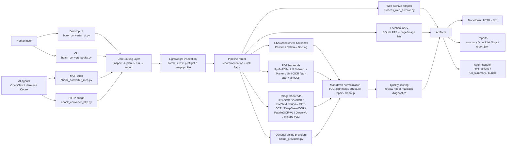
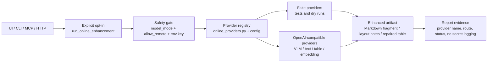
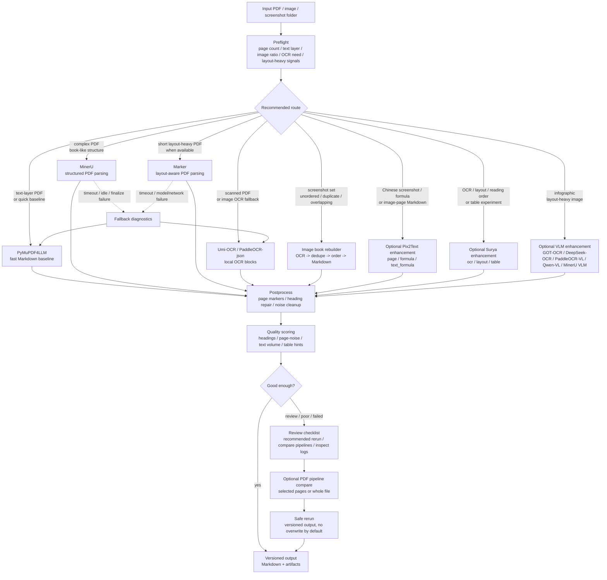

# Architecture

This project is an orchestration layer for converting mixed graphic/text materials into Markdown-oriented artifacts. It does not try to replace specialist parsers, OCR engines, or document AI models. Instead, it inspects inputs, routes them to the best available backend, records diagnostics, falls back safely, and exposes the same workflow through UI, CLI, HTTP, and MCP.

## System Overview

## Online Provider Boundary

Online model APIs are optional enhancement tools, not default conversion paths. Agents and UI code should call the project-level provider abstraction instead of wiring vendor APIs into MinerU, PaddleOCR, structure repair, or screenshot-book logic directly.

Current provider interfaces are:

- `OcrLayoutProvider`: OCR blocks with coordinates, available through the explicit online/fake enhancement entrypoint.
- `VlmLayoutProvider`: image or page layout description for infographic and layout-heavy pages.
- `TextStructureProvider`: Markdown hierarchy and heading repair.
- `TableRepairProvider`: table-only repair without forcing card/step layouts into tables.
- `EmbeddingProvider`: optional embeddings for future semantic location/search support, available through the explicit online/fake enhancement entrypoint.

The default conversion path remains local-first. Real remote calls require explicit `provider_mode=openai_compatible`, non-local `model_mode`, and `allow_remote=true`.

## PDF And Image Routing

PDFs and image-heavy inputs are routed through preflight instead of blindly launching the heaviest model. The goal is stable completion first, then targeted quality improvement when the report says the output needs review.

## Design Boundaries

- The project owns orchestration, configuration, logging, fallback, quality review, artifacts, UI, CLI, HTTP, and MCP contracts.
- Specialist tools own format conversion, PDF parsing, OCR, layout analysis, and model inference.
- Heavy backends are optional. A minimal install should still handle common ebooks and text-layer PDFs.
- Risky reruns should be versioned by default. Overwriting original output should be an explicit user choice.
- Agent-facing calls should return artifact paths and `next_actions` instead of making agents guess local paths or parse raw logs.

## Structure Repair Evidence

Markdown structure repair is intentionally explainable. When a conversion promotes or normalizes headings, the per-book `*.report.json` can include `structure_repair` with:

- `decisions[]`: one record per repaired or evidence-backed heading line.
- `action`: `promoted_to_heading`, `normalized_heading`, or `kept_with_evidence`.
- `confidence`: a conservative 0-1 score derived from domain grammar, external candidates, parent context, PDF outline, font-size jumps, MinerU titles, or Docling headings.
- `reason` and `signals`: human-readable explanation plus machine-readable evidence.
- `inferred_outline`: the resulting Markdown heading hierarchy with parent/path fields.

This keeps the default path local and rule-first while leaving a clear future hook for online `TextStructureProvider` fallback on low-confidence segments.

## Main Modules

| Area | Main Files |
| --- | --- |
| Desktop UI | `book_converter_ui.py` |
| CLI and core conversion | `batch_convert_books.py` |
| Agent MCP server | `ebook_converter_mcp.py` |
| Agent HTTP bridge | `ebook_converter_http.py` |
| HTTP config | `http_config.py`, `config/http.env` |
| Document inspection | `document_inspector.py` |
| Optional Tika inspection | `tika_backend.py` |
| Optional GROBID academic inspection | `grobid_backend.py` |
| Location index | `document_locator.py` |
| PDF layout/table diagnostics | `pdf_layout_diagnostics.py` |
| Screenshot/image book rebuilding | `image_book_rebuilder.py` |
| Scanned-book pdf-craft backend | `pdfcraft_backend.py` |
| VLM OCR olmOCR backend | `olmocr_backend.py` |
| Online model provider abstraction | `online_providers.py`, `config/online_providers.example.json`, legacy `config/online_models.example.json` |
| Web archive visual check | `process_web_archive.py`, `process-web-archive.cmd` |
| Structure repair | `structure_repair.py` |
| Artifact schema | `artifact_schema.py` |
| Environment diagnostics | `environment_report.py` |

## Third-Party Boundary

This repository mainly contains glue code and workflow code. It references or invokes third-party tools such as Pandoc, Calibre, PyMuPDF4LLM, MinerU, Marker, Docling, Apache Tika, GROBID, pdf-craft, olmOCR, pdfplumber, Camelot, Tabula, Umi-OCR, CnOCR, Pix2Text, Surya, GOT-OCR, DeepSeek-OCR, PaddleOCR-VL, and Qwen-VL wrappers, but it does not vendor their binaries, model weights, or datasets. See [../THIRD_PARTY_NOTICES.md](../THIRD_PARTY_NOTICES.md) for the third-party notice and license boundary.
