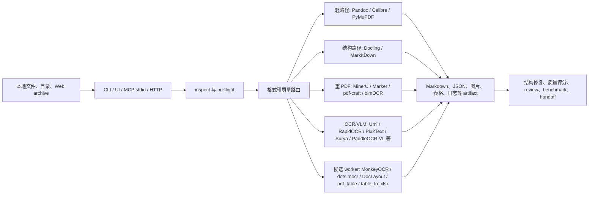
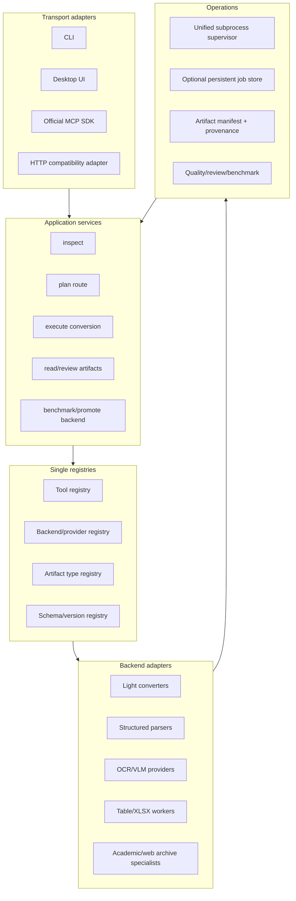

# ebook_markdown_pipeline 架构与开源复用深度审计

日期：2026-07-10
状态：已完成源码与外部项目调查，作为后续 patch 的决策基线
项目：`D:\used-by-codex\ebook_markdown_pipeline`
边界：本轮未安装模型、未启动服务、未处理真实私有文档、未改动运行代码

## 结论先行

这个项目的正确定位仍然是“本地文档转换编排层”，不是再造一个 OCR、PDF 解析器或文档大模型。当前最有价值的改进并不是继续增加大量重模型，而是：

1. 先把 MCP 工具、artifact 类型、backend/provider、作业状态四类注册信息收拢成单一事实源。
2. 逐步用官方 MCP Python SDK 替换手写协议、schema 和分发代码，同时保留现有 `call_tool()` 兼容门面。
3. 用 pytest 接管现有 73 个脚本式测试，先做兼容收集层，再逐步改成参数化负面测试。
4. 用 OmniDocBench 的评测方法扩充当前 benchmark 层；新模型只能替换旧重后端，不能无限叠加。
5. 新增解析能力时，优先级应为 `gmft` 数字 PDF 表格 baseline、OpenDataLoader PDF 结构化 baseline、GLM-OCR 远程/自托管 provider；OCRFlux、Chandra、dots.mocr、MonkeyOCR 保持显式重后端或远程对比。
6. 拍照/扫描表格到 XLSX 的既有决策不变：PaddleOCR TableRecognitionPipelineV2 为首选重后端，`img2table` 为轻量 baseline，RapidTable 为结构 fallback；`gmft` 只适合有文本层的 PDF，不适合扫描图片。

本轮还确认了一个需要优先修复的契约漂移：当前 `scripts/dots_mocr_worker.py` 生成的命令使用旧目录 `dots_ocr/parser.py`、`--input_path` 和 `--output_dir`；当前上游仓库实际为 `dots_mocr/parser.py`，输入是位置参数，输出参数是 `--output`。因此该 worker 的 `plan` 结果目前不能直接复制执行。

## 一、当前架构

### 1.1 高层数据流

### 1.2 主要模块边界

| 层 | 当前文件 | 职责 | 观察 |
| --- | --- | --- | --- |
| 核心批处理与路由 | `batch_convert_books.py` | 输入收集、依赖检查、格式路由、PDF 管道、后处理、质量与报告 | 6778 行，已经同时承担 router、executor、supervisor、normalizer、reporter |
| MCP 与 Agent 门面 | `ebook_converter_mcp.py` | MCP stdio、工具 schema、工具分发、作业、artifact 读取、handoff | 3938 行；传输、catalog、handler、job、artifact 五类职责混在一处 |
| HTTP 适配 | `ebook_converter_http.py` | `/health`、`/call`、token、HTTP contract | 直接调用 MCP 模块的 `call_tool()`；它是适配器，不是独立业务服务 |
| 桌面入口 | `book_converter_ui.py` | Tkinter 操作与人工流程 | 3047 行，和核心参数/状态存在继续漂移的风险 |
| 输入检查 | `document_inspector.py`、`pdf_layout_diagnostics.py` | 文件类型、PDF 文本层/版面、候选增强建议 | 候选建议与实际 backend registry 仍是两套信息 |
| 后端适配 | `*_backend.py`、`ocr_providers.py`、`online_providers.py` | Python API、外部命令、OpenAI-compatible provider | 已有 adapter 雏形，但 active backend 与 candidate backend 未统一 |
| 候选 worker | `scripts/*_worker.py`、`external_wrapper_utils.py` | `plan/fake/execute`、健康状态、统一 sidecar | 这是当前最清晰的隔离边界，应继续保留 |
| artifact/schema | `artifact_schema.py`、`candidate_artifact_schema.py`、`diagnostic_artifact_schema.py` | artifact 描述、候选/诊断 JSON 校验与摘要 | 基础 artifact schema 很薄；类型、可读性、推断、摘要分散在多处 |
| 质量与复查 | `quality_improvement_queue.py`、`review_lifecycle.py`、benchmark scripts | 回归、质量队列、人工复查、候选晋级 | 已具备框架，缺真实负面 fixture 和统一外部 benchmark adapter |

### 1.3 当前运行契约

- HTTP 是按需适配器，不是常驻服务。
- 当前端口来自 `config/http.env`，审计时为 `9241`；旧的 `8765` 已过期。
- 对可启动子进程的 Agent，优先 MCP stdio；HTTP 未监听不等于转换器整体故障。
- 重模型、外部服务和模型下载必须显式启用；candidate 默认只能 `plan` 或 `fake`。
- 默认轻路径继续保留，不能让 VLM 替换 Pandoc、Calibre、PyMuPDF 这类便宜且可解释的路径。

## 二、已经复用或参考过的开源项目

### 2.1 复用方式说明

源码和现有第三方说明中没有发现把整段第三方实现直接 vendor 进本仓库的证据。当前复用主要有三种：

- 直接调用用户另行安装的命令或 Python 包。
- 编写项目自己的 wrapper/backend，把第三方输出归一化为本项目 artifact。
- 只吸收上游架构模式、schema、provider 或评测思路。

因此，“项目支持某工具”通常不等于“项目包含该工具源码或模型”。

### 2.2 已直接调用或已有可执行 adapter

| 角色 | 项目 | 本项目吸收方式 | 当前判断 |
| --- | --- | --- | --- |
| 电子书/文本转换 | Pandoc、Calibre `ebook-convert` | 外部命令 + Markdown 清理 | 继续作为默认轻路径 |
| PDF 预检/快速路径 | PyMuPDF、PyMuPDF4LLM、pdfplumber | Python API、文本层、outline、坐标与表格诊断 | 核心轻路径，继续保留 |
| 结构化文档 | Docling、MarkItDown | 独立 backend；Markdown、heading、metadata | Docling 应进一步导出 lossless JSON/provenance；MarkItDown 保持 baseline |
| 复杂 PDF | MinerU、Marker | 显式重后端、分段、超时、fallback | 保留但不扩大默认使用 |
| 扫描 PDF 预处理 | OCRmyPDF | 生成 searchable PDF 后回到 fast path | 设计正确；可继续吸收其稳定退出码和插件边界 |
| 扫描书 | pdf-craft | 显式 worker/backend | 只做扫描书/TOC 专项 |
| VLM PDF benchmark | olmOCR | 显式 PDF backend、远程/GPU 对比 | 保留 benchmark 角色 |
| 格式/学术检查 | Apache Tika、GROBID | 显式 inspect 增强 | 不进入主转换路径 |
| 本地 OCR | Umi-OCR/PaddleOCR-json、RapidOCR、CnOCR | 外部进程或 provider | RapidOCR 适合低成本 baseline；CnOCR 保持对比 |
| 图片/公式/版面 | Pix2Text、Surya | 显式 wrapper | 中文公式与 reading-order 专项 |
| OCR/VLM 实验 | GOT-OCR、DeepSeek-OCR、PaddleOCR-VL、Qwen-VL | wrapper 或 provider | PaddleOCR-VL 优先评测；其余只能在证明可替换旧后端后晋级 |
| 表格诊断 | Camelot、Tabula/tabula-py、pdfplumber | 表格页诊断与 artifact fallback | 有文本层 PDF 可继续用；不适合扫描表格 |
| Office 图片补 OCR | RapidOCR | 从 DOCX/PPTX/XLSX 资源提取后插入 OCR 块 | 已形成实用专项能力 |

### 2.3 已有 candidate-only wrapper

| Candidate | 当前状态 | 已有可吸收 artifact | 审计结论 |
| --- | --- | --- | --- |
| MonkeyOCR | `plan/fake/execute`，execute 依赖外部仓库与模型 | Markdown、middle JSON、content list、layout/span/model PDF、图片目录 | 当前 CLI 参数与上游一致；健康检查仍依赖固定 `model_weight` 布局，应从 config 解析实际权重路径 |
| dots.mocr | `plan/fake`，execute 明确未实现 | layout JSON、Markdown、去页眉页脚 Markdown、overlay、page index | 当前 plan 命令已漂移，必须先修正目录和参数，再实现手动 vLLM 服务调用 |
| DocLayout-YOLO | `plan/fake` | bbox、layout candidates、overlay、summary | 继续只做 evidence，不直接替换 Markdown |
| pdf_table | `plan/fake/execute` | Markdown、HTML、cell JSON、overlay、table candidates | 上游最后活跃于 2024、体量重、功能与 Paddle/gmft 重叠，应降为 legacy comparison |
| table_to_xlsx | `plan/fake/execute` | `.xlsx`、table candidates、summary、Paddle raw HTML/JSON | 决策正确；PaddleOCR TableRecognitionPipelineV2 首选，img2table baseline 已验证 |

### 2.4 已明确参考的架构模式

| 来源 | 已参考的模式 | 还可继续吸收的部分 |
| --- | --- | --- |
| Marker | Provider / Builder / Processor / Renderer / Converter 分层，LLM service 可插拔 | 把当前 backend 执行、artifact parser、postprocess 从大路由函数中拆开 |
| MinerU | pipeline / VLM / remote service 分离 | 所有重后端统一 local、remote、disabled 三态，不让路由依赖部署位置 |
| PaddleOCR MCP/Skills | Agent-facing 稳定工具契约 | 工具 schema 从单一 catalog 生成，provider 升级不改变 Agent contract |
| Docling / DoclingDocument | rich document object + provenance + 多格式导出 | 当前只取 Markdown 和 heading，尚未充分利用 lossless JSON、bbox、page provenance |
| Unstructured | partition、element、chunking、ingest status | 借鉴 element/chunk lifecycle，不引入整套企业 ingest |
| OCRmyPDF | 稳定退出码、sidecar、plugin hooks、临时目录生命周期 | 统一外部 worker 的错误分类、可重试性和 artifact sidecar |
| Open Parse | Pydantic schema、不可变元素、ProcessingStep pipeline | 借鉴 typed element 与处理 step，不引入其整套 parser |
| deepdoctection | typed dataflow、pipeline component、Page 对象、可视化 | 只借鉴数据流和组件测试，避免 Detectron2/模型全栈依赖 |

## 三、源码层主要问题

### P0：会直接阻碍继续扩展

1. `ebook_converter_mcp.py` 同时维护 MCP 协议、工具 schema、35 路 `if name == ...` 分发、作业状态和 artifact 读取。任何新增工具都要在多处同步。
2. artifact 类型至少由 `JSON_ARTIFACT_TYPES`、`READABLE_ARTIFACT_TYPES`、`infer_artifact_type()` 三处共同维护，另外还有 candidate/diagnostic schema 注册；新增 artifact 很容易漏掉摘要或读取能力。
3. `dots.mocr` worker 的计划命令与当前上游 CLI 不一致，属于“plan 看起来正常、实际无法执行”的契约错误。
4. 73 个 `scripts/test_*.py` 全部采用 `main()` 脚本模式，没有 pytest/unittest 收集函数；只有少量文件含 Python `assert`。当前 readiness 能证明约定路径成功，但难以系统覆盖参数化负面场景。

### P1：可靠性与维护成本

1. `batch_convert_books.py` 6778 行，路由、执行、子进程监管、清理、质量与报告耦合。
2. `JOBS` 是进程内字典；重启即丢失，没有正式 cancel、lease、restart recovery。文件中还同时存在内联建 job 和 `create_job()` 两种创建路径。
3. HTTP 直接复用 MCP `call_tool()` 是正确方向，但 MCP transport 本身仍为手写 JSON-RPC，无法直接获得官方 SDK 的生命周期、进度、标准 transport 与上下文能力。
4. candidate registry、OCR provider registry、online provider registry、健康检查和实际执行器是平行体系；同一 backend 的 display name、环境、模型、artifact、executor 仍可能漂移。
5. `external_wrapper_utils.run_command()` 只使用普通 `subprocess.run(timeout=...)`，而主 PDF 管道已有更完整的进度、空闲/收尾超时、进程树终止逻辑。两套 supervisor 应统一。
6. 部分 worker 通过第一个匹配的 `*.json`/`*.md` 猜输出，模型升级后可能读到错误 sidecar；应让 adapter 显式声明 output resolver。
7. schema version 分散为多个字符串常量，没有兼容矩阵或迁移器。

### 已经做对、应保护的部分

- candidate 的 `plan/fake/execute` 和“不自动装模型、不自动启动服务”边界清楚。
- HTTP 按需、MCP/CLI 可降级的服务契约清楚。
- 默认轻路径与重后端分离，避免每份文档都进入 GPU/VLM。
- artifact、quality gate、review lifecycle、handoff 已经形成可组合的基础。
- `table_to_xlsx` 把扫描表格识别和普通 Markdown 转换分成独立 lane，方向正确。

## 四、扩展搜索后的新候选与决策

### 4.1 最高优先级：工程基础设施

| 项目 | 可直接吸收的部分 | 接入位置 | 决策 |
| --- | --- | --- | --- |
| [MCP Python SDK](https://github.com/modelcontextprotocol/python-sdk) | FastMCP tool 注册、stdio/Streamable HTTP、Context、日志与 progress | 新 `mcp_server.py`；现有 `call_tool()` 保留为兼容 handler | P0，分阶段接入，不做大爆炸重写 |
| [pytest](https://github.com/pytest-dev/pytest) | 收集、参数化、fixture、negative tests、CI 退出码 | `tests/` 兼容层先调用现有 73 个 `main()` | P0，先接管测试再拆大文件 |
| [pluggy](https://github.com/pytest-dev/pluggy) | hookspec/hookimpl、entry point 插件发现、first-result 规则 | backend/provider hook 层 | P1；先用显式 registry，确有第三方插件需求后再引入，不为抽象而抽象 |
| [Huey](https://github.com/coleifer/huey) | SQLite queue、result store、retry/revoke、signals、immediate test mode | 可选 `job_store.py` | P2；只有确认需要跨进程恢复/取消时才引入，当前个人按需 HTTP 不需要常驻 worker |
| [OmniDocBench](https://github.com/opendatalab/OmniDocBench) | text edit distance、TEDS、formula CDM、reading order、layout 指标和 inference adapter 形态 | `benchmarks/adapters/omnidocbench.py` | P0/P1，优先接评测代码与小型公开样本，不把全量数据塞进仓库 |

### 4.2 最值得新增的解析/识别候选

| 项目 | 具体值得复用的模块 | 最合适的本地位置 | 成本/限制 | 决策 |
| --- | --- | --- | --- | --- |
| [gmft](https://github.com/conjuncts/gmft) | TableDetector、AutoTableFormatter、PyPDFium2Document、DataFrame/HTML/Markdown/CSV 导出 | 新 `gmft_table_worker.py` 或 `pdf_layout_diagnostics` provider | CPU 可用、无 OCR；merged cell/误检仍需 review | P0/P1，数字 PDF 表格首个新增 baseline；可替代部分 Camelot/Tabula 对比 |
| [OpenDataLoader PDF](https://github.com/opendataloader-project/opendataloader-pdf) | deterministic fast parser、bbox JSON、reading order、table/heading、hybrid fallback | candidate-only `opendataloader_pdf_backend.py` | 需要 Java 11；其自报 benchmark 需本项目样本复核 | P1，先 plan/fake/小样本，不进默认 |
| [GLM-OCR](https://github.com/zai-org/GLM-OCR) | 0.9B 模型、SDK、MaaS-compatible server/client、layout crop + 并行 OCR + Markdown/JSON | 现有 online provider 与 remote OCR eval | 自托管仍需模型/GPU；API 涉及隐私边界 | P1，先做 provider profile，不新造独立大 wrapper |
| [PaddleOCR](https://github.com/PaddlePaddle/PaddleOCR) | PaddleOCR-VL-1.6、PP-StructureV3、TableRecognitionPipelineV2、跨页表格与标题 | 现有 Paddle wrapper、`table_to_xlsx` | Paddle 环境/模型较重 | P0 评测优先，深化已有接入，不重复添加相邻模型 |
| [Docling](https://github.com/docling-project/docling) | DoclingDocument lossless JSON、provenance、EPUB/email/audio 等扩展、MCP/serve 参考 | `docling_backend.py` 与 artifact schema | 当前项目只消费 Markdown/heading，能力利用不足 | P1，先导出结构 JSON 与 provenance，再考虑更多格式 |
| [Kreuzberg](https://github.com/kreuzberg-dev/kreuzberg) | Rust fast parser、批量 API、OCR/plugin/validator/postprocessor、CLI/REST/MCP | 新 baseline benchmark，不直接替换 router | 与 Docling/MarkItDown/Tika 重叠；native runtime 增加运维面 | P2，个人使用许可证不是障碍，但只有质量/速度胜出才接入 |

### 4.3 保留为重后端或专项对比

| 项目 | 最值得吸收的能力 | 决策 |
| --- | --- | --- |
| [OCRFlux](https://github.com/chatdoc-com/OCRFlux) | 跨页表格与跨页段落合并、fallback pages、JSONL job result | P2 remote/GPU benchmark；3B 模型建议 24GB+ VRAM，不适合本机默认 |
| [Chandra OCR](https://github.com/datalab-to/chandra) | 手写、表单、checkbox、复杂表格、HTML/Markdown/JSON、vLLM/HF 双模式 | P2 远程专项；只在表单/手写样本证明优势后替换旧重后端 |
| [dots.mocr](https://github.com/rednote-hilab/dots.mocr) | 单模型布局+OCR、JSON bbox、Markdown、去页眉页脚版、vLLM/OpenAI-compatible | 先修 wrapper 契约，再做手动服务 execute；不自动启动 vLLM |
| [MonkeyOCR](https://github.com/Yuliang-Liu/MonkeyOCR) | structure-recognition-relation triplet、middle/content/layout debug artifact、批量 page grouping | 保持 candidate；先解析真实 config 和输出目录，不硬编码模型缓存判断 |
| [PDF-Extract-Kit](https://github.com/opendatalab/PDF-Extract-Kit) | DocLayout-YOLO、UniMERNet、StructEqTable、模块化 config | 不引入整包；只有公式/表格专项出现明确空缺时抽单模块 |
| [deepdoctection](https://github.com/deepdoctection/deepdoctection) | typed Page/DataFlow、pipeline component、可视化与模型 catalog | 只吸收设计；整套 PyTorch/Detectron2/模型编排与现有层重叠 |
| [Open Parse](https://github.com/Filimoa/open-parse) | typed schema、ProcessingStep、节点与原 PDF overlay | 只参考 schema/step；解析能力与现有 PyMuPDF/Docling/gmft 重叠 |

### 4.4 只参考产品/复查体验

- Docling Studio：吸收 bbox overlay、页图与结构 JSON 联动、chunk inspector，不引入另一套服务壳。
- Folio-OCR：吸收“原页/识别结果/编辑结果”三栏复查、批量页状态和人工校正流，不把其整套桌面应用嵌入本项目。
- paperless-ngx：继续只参考 consume -> OCR -> index -> review 生命周期。
- Unstructured/Unstract/RAGFlow/OmniParse/MegaParse：继续只参考 ingest、pipeline、状态或评测；它们都是另一个编排平台，直接引入会形成双总控。

### 4.5 不建议继续投入的候选

- `pdf_table`：保留现有 wrapper 以便历史对比，但上游活跃度低、模型栈重，优先用 `gmft` 处理文本层 PDF、用 PaddleOCR 处理扫描/照片表格。
- GOT-OCR、DeepSeek-OCR、Unlimited-OCR：现有显式入口足够；除非统一 benchmark 证明能替换 PaddleOCR-VL/Surya/MinerU/olmOCR 中至少一个，否则不再扩展。
- 完整引入 deepdoctection、PDF-Extract-Kit、RAGFlow、Unstract、paperless-ngx：都会复制现有编排、队列或 UI 层。
- 直接把 Docling、Kreuzberg 或 OpenDataLoader 设成全格式默认：先做同样本速度、结构保留和错误恢复比较。

## 五、目标架构

关键约束：

- transport 不包含业务路由。
- backend profile 必须同时声明 health、plan、execute、output resolver、artifact contract、成本和晋级策略。
- artifact type 只注册一次，由 registry 生成可读类型、JSON 类型、media type、推断规则、validator 和 summarizer。
- MCP/HTTP/CLI 共用同一个 tool catalog 与 handler，不各自维护 schema。
- 重后端只由 benchmark 结果晋级，默认路由不依据 README 宣称或单个私有样本。

## 六、建议执行路线

### Phase 0：先降低回归风险

1. 修复 `dots_mocr_worker.py` 的上游 CLI 契约，并新增纯命令构造测试；不安装模型、不启动服务。
2. 建立 `tests/` pytest 兼容层，参数化调用现有 73 个 `main()` 脚本；先不一次性重写所有测试。
3. 增加 invalid JSON、缺字段、空列表、未知 tool/backend/artifact、超时、错误退出码等负面测试。
4. 抽出 `ArtifactTypeProfile` 单一 registry，先覆盖当前重复的 JSON/readable/infer 三套映射。

### Phase 1：拆 MCP 上帝文件，但保持兼容

1. `tool_catalog.py`：工具名、输入 schema、handler、风险/transport 元数据。
2. `artifact_reader.py`：类型推断、读取、校验、摘要。
3. `job_manager.py`：线程安全状态、事件、取消接口；先可保持内存实现。
4. `mcp_server.py`：官方 MCP SDK adapter。
5. 现有 `ebook_converter_mcp.call_tool()` 暂时变成对新 catalog 的兼容转发，避免 HTTP 与脚本同时失效。

### Phase 2：统一 backend/provider 与进程监管

1. 合并 active/candidate/online/OCR profile 的共同字段。
2. 让每个 backend 提供显式 output resolver，不再用全局 glob 猜 artifact。
3. 把主 PDF 管道已有的进程树终止、空闲超时、收尾超时和 progress parser 提炼为共享 supervisor，candidate worker 复用它。
4. 只有确认需要 HTTP 重启恢复、任务取消或队列查看时，再评估 SQLiteHuey；否则保持无常驻服务。

### Phase 3：只新增能填空缺的候选

1. `gmft`：数字 PDF 表格 baseline。
2. OmniDocBench adapter：统一文本、表格、公式、阅读顺序指标。
3. Docling lossless JSON/provenance artifact。
4. GLM-OCR provider profile：先走现有 remote eval。
5. OpenDataLoader PDF candidate：只做公开 fixture 对比。
6. 修好 dots.mocr 后才实现 execute；MonkeyOCR、OCRFlux、Chandra 继续等待硬件/远程环境与 benchmark。

## 七、需要人工确认的决策

1. 是否接受核心运行新增官方 `mcp` 依赖，还是继续保持 MCP transport 零第三方依赖。
2. 是否真的需要跨进程作业恢复/取消；如果只是个人按需 CLI/MCP，暂不引入 Huey 更简单。
3. 是否接受 Java 11 作为 OpenDataLoader PDF 的 candidate 环境；不接受则跳过该候选。
4. 后续重模型评测使用本机 GPU、手动远程 vLLM，还是只用云 API；这决定 GLM-OCR/dots/Monkey/OCRFlux/Chandra 的 adapter 形态。
5. 是否允许把小型公开 benchmark fixture 放入仓库；全量 OmniDocBench 不建议直接提交。

## 八、证据与来源

### 本地源码证据

- `batch_convert_books.py`：核心批处理、路由、PDF pipeline、进程监管、质量与报告。
- `ebook_converter_mcp.py`：手写 MCP、工具 schema、35 路分发、内存 jobs、artifact type/read/infer。
- `ebook_converter_http.py`：HTTP 直接复用 `call_tool()`。
- `candidate_backend_registry.py`：candidate profile、plan/fake、模型/服务边界。
- `scripts/external_wrapper_utils.py`：candidate worker 的公共 result/artifact/command contract。
- `scripts/dots_mocr_worker.py`：当前上游 CLI 漂移证据。
- `scripts/table_to_xlsx_worker.py`：Paddle/img2table/RapidTable 路线。
- `docs/OPEN_SOURCE_PROJECT_INVENTORY.md`、`docs/REFERENCES_AND_REUSE.md`、`docs/OPTIONAL_OCR_VLM_REPLACEMENT_RESEARCH.md`：历史调查基线。
- Git 历史关键点：`6743d34` 初始清单、`ec51428` MarkItDown、`7c6ec4b` OCRmyPDF、`c3dcb12` OCR backends、`db23180` document intelligence workers、`98a7f95` table-to-xlsx、`3a32425` img2table health。

### 上游一手来源

- MCP Python SDK: https://github.com/modelcontextprotocol/python-sdk
- Docling: https://github.com/docling-project/docling
- OCRmyPDF: https://github.com/ocrmypdf/OCRmyPDF
- OmniDocBench: https://github.com/opendatalab/OmniDocBench
- PaddleOCR: https://github.com/PaddlePaddle/PaddleOCR
- GLM-OCR: https://github.com/zai-org/GLM-OCR
- OCRFlux: https://github.com/chatdoc-com/OCRFlux
- dots.mocr: https://github.com/rednote-hilab/dots.mocr
- MonkeyOCR: https://github.com/Yuliang-Liu/MonkeyOCR
- Chandra: https://github.com/datalab-to/chandra
- gmft: https://github.com/conjuncts/gmft
- OpenDataLoader PDF: https://github.com/opendataloader-project/opendataloader-pdf
- PDF-Extract-Kit: https://github.com/opendatalab/PDF-Extract-Kit
- deepdoctection: https://github.com/deepdoctection/deepdoctection
- Open Parse: https://github.com/Filimoa/open-parse
- pluggy: https://github.com/pytest-dev/pluggy
- Huey: https://github.com/coleifer/huey

## 最终决策摘要

- 保留“轻路径默认、重后端显式、artifact 驱动、人工复查”的总体方向。
- 先修 registry、测试和 MCP 工程层，再扩展模型。
- 新解析项目只优先推进 `gmft`、OmniDocBench adapter、Docling structured artifact、GLM-OCR provider、OpenDataLoader candidate。
- `dots.mocr` 先修契约；`pdf_table` 降级；OCRFlux/Chandra/MonkeyOCR 保持重型显式对比。
- 本轮不安装任何模型。下一次代码修改应从 Phase 0 的纯契约/测试 patch 开始。
