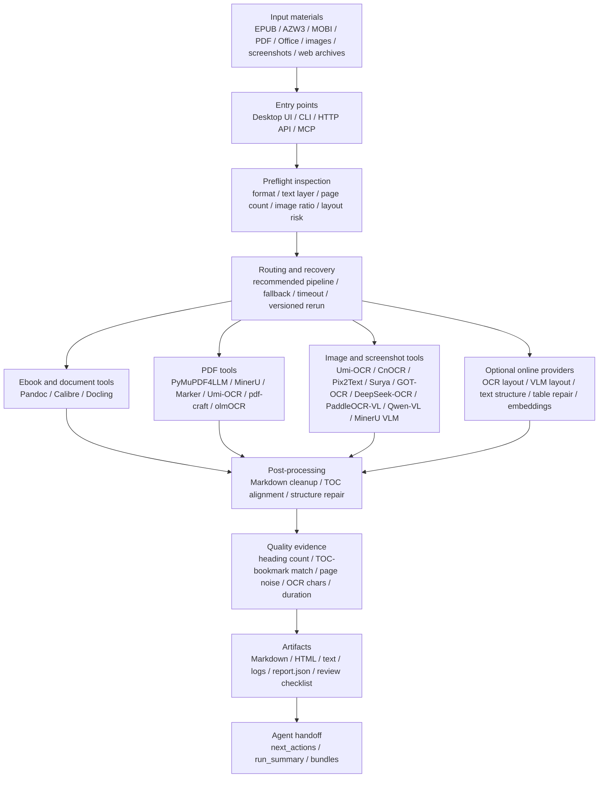

# Architecture Diagram

This is the short, shareable architecture map for the repository. For module-level details, see [ARCHITECTURE.md](ARCHITECTURE.md). For reused tools, reference patterns, and license boundaries, see [REFERENCES_AND_REUSE.md](REFERENCES_AND_REUSE.md) and [../THIRD_PARTY_NOTICES.md](../THIRD_PARTY_NOTICES.md).

## One-Page Map

## What The Repository Owns

- Orchestration, routing, configuration, timeout handling, fallback, versioned reruns, and recovery logic.
- Desktop UI, CLI, HTTP API, MCP tools, reports, review checklists, and agent handoff artifacts.
- Markdown normalization, TOC alignment, structure repair rules, and quality evidence aggregation.

## What Existing Tools Own

| Tool / Project | Role | Integration Boundary |
| --- | --- | --- |
| Pandoc | Common ebook, text, Markdown, and HTML conversion. | External command. |
| Calibre / `ebook-convert` | AZW, AZW3, MOBI, and RTF normalization. | External command. |
| PyMuPDF / PyMuPDF4LLM | PDF inspection, outline extraction, rendering, and fast PDF-to-Markdown fallback. | Python package/API. |
| MinerU | Optional structured PDF parsing for complex or scanned documents. | Optional external backend. |
| Marker | Optional layout-aware PDF parsing. | Optional external backend. |
| Docling | Optional Office/document/PDF structure backend. | Optional Python package/backend. |
| Apache Tika | Optional MIME/metadata/text-sample inspection for unusual formats. | Optional Tika Server/command wrapper. |
| GROBID | Optional academic PDF/TEI inspection for papers and references. | Optional GROBID Server. |
| pdf-craft | Optional scanned-book PDF-to-Markdown reconstruction with TOC assumptions. | Optional Python package/backend. |
| olmOCR | Optional VLM PDF/image-to-Markdown benchmark backend. | Optional explicit worker/backend. |
| pdfplumber / Camelot / Tabula | Optional PDF layout and text-based table diagnostics. | Optional Python package/Java-backed table tools. |
| Umi-OCR / PaddleOCR-json / RapidOCR / CnOCR | Local OCR blocks for images and scanned pages. | External local/Python OCR engine. |
| Pix2Text | Optional Chinese screenshot, formula, and image-page Markdown enhancement. | Optional wrapper/Python package. |
| Surya | Optional OCR, layout, reading-order, and table enhancement. | Optional wrapper/Python package. |
| GOT-OCR 2.0 | Optional CUDA image OCR experiment wrapper. | Optional explicit wrapper. |
| DeepSeek-OCR | Optional CUDA/Transformers VLM OCR experiment wrapper. | Optional explicit wrapper. |
| PaddleOCR-VL / Qwen-VL / MinerU VLM | Optional layout-heavy image, infographic, or difficult-page enhancement. | Optional wrappers/backends. |

## Reference Patterns

- Marker-style pluggable LLM service: useful for structure repair, table repair, and Markdown cleanup providers.
- MinerU-style local/remote VLM split: useful when heavy vision models move from local CPU/GPU to remote GPU or online APIs.
- PaddleOCR MCP-style stable tool contract: useful for keeping agent calls stable while backends change.
- Docling-style artifact boundary: useful for converting messy files into structured artifacts before agents consume them.

These are architectural references and integration patterns. This repository does not vendor third-party binaries, model weights, datasets, or upstream parser/OCR/model source trees.
