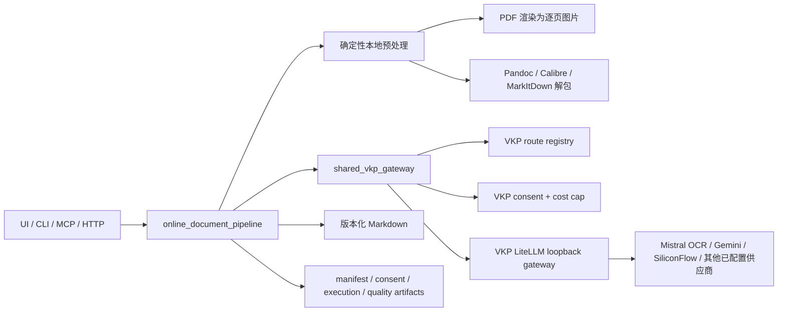

# 纯在线大模型 API 模式：架构、源码复用与变更证据

更新时间：2026-08-01 23:35:28

追加验证：2026-08-02 00:01:43 | Codex（GPT-5）

边界修复验证：2026-08-02 00:09:00 | Codex（GPT-5）

真实 loopback 集成验证：2026-08-02 00:28:09 | Codex（GPT-5）

真实 LiteLLM loopback 验证：2026-08-02 00:34:42 | Codex（GPT-5）

在线 VLM 与远程证据闭环：2026-08-02 00:57:12 | Codex（GPT-5）

全格式与输出隔离验证：2026-08-02 01:44:25 | Codex（GPT-5）

真实供应商验收入口：2026-08-02 01:58:12 | Codex（GPT-5）

结构无改动状态修复：2026-08-02 02:02:36 | Codex（GPT-5）

快速供应商选择与公开检查收口：2026-08-02 02:08:04 | Codex（GPT-5）

真实供应商 smoke 与网关启动竞态修复：2026-08-02 08:28:42 | Codex（GPT-5）

真实输出围栏归一化修复：2026-08-02 08:40:28 | Codex（GPT-5）

外部代码审查安全收口：2026-08-02 09:37:26 | Codex（GPT-5）

执行者：Codex（GPT-5）

## 结论

项目此前只有“本地转换后在线补强”，不能称为完整纯在线模式。本轮新增 `online_only` 主管道：本地只做确定性的格式解包、PDF 分页渲染、Markdown 分块和 artifact 管理；OCR、视觉理解和标题结构推理由在线模型完成。

默认仍为 `local-first`。纯在线模式必须显式选择，并且真实执行同时要求：

- `provider_mode=vkp_shared`；
- `execute=true`；
- `confirm_data_export=true`；
- 正数 `max_estimated_cost_usd`；
- VKP LiteLLM gateway 已运行，或显式允许按需启动。

API key 不复制到本项目。供应商、模型、路由和密钥继续由 `video-knowledge-pipeline` 管理；密钥只保存在 VKP 的 Windows DPAPI secret store，并只在 gateway 子进程运行时解密到环境变量。

## 架构



### 模式定义

“纯在线”指所有需要模型推理的步骤都在远程执行，不等于禁止本地读取文件。以下本地步骤不调用模型：

- PDF 页面渲染；
- EPUB、AZW3、MOBI、Office、TXT 等格式的确定性文本解包；
- 图片提取、哈希、分块、Markdown 拼接；
- 质量统计、日志、恢复 manifest 和安全检查。

这一定义避免了把快速、稳定、无推理的格式解析也强制改成收费 API，同时确保本地 MinerU、Marker、RapidOCR、Docling 模型不会混入 `online_only` 路径。

## 源码拉取与运行证据

所有项目均已拉取到本地未提交的源码评测工作区，判断基于固定 commit 的源码阅读和本地运行，不只依据项目主页。源码工作区不属于发布包，公开文档只保留仓库名、commit 和可复现实验证据。

| 项目 | 固定提交 | 本地运行证据 | 吸收的模块/架构 | 决策 |
|---|---|---|---|---|
| `openai/openai-python` | `cbdc98b6c1e21df7ee43d13b5de7243c6ed1ee7f` | 客户端构造、base URL、timeout、`max_retries=0` smoke 通过；全量测试因缺 `pytest_asyncio` 未跑完 | 官方 timeout、retry、idempotency 与 OpenAI-compatible transport | 保留为直接 provider 的可选传输；共享模式优先 VKP/LiteLLM，不复制重试实现 |
| `mistralai/client-python` | `7749c848a3777f504f01f16fba61c61203afb810` | OCR client 导入/实例化通过；源码核对上传、页范围、表格格式、置信度、同步/异步和 429/5xx 重试 | Mistral OCR 能力 | 通过 VKP 的 `ocr` route 和 LiteLLM 复用，不在 ebook 项目保存第二份 Mistral key |
| `run-llama/llama_cloud_services` | `f385e96ab82ddb88330277c34394546398c8bed0` | `JobResult` 纯结果测试通过 | job id、状态轮询、结果/图片 artifact、可恢复异步任务 | 暂不直连；借鉴在线 run manifest 和恢复契约，避免新增独立 key |
| `Unstructured-IO/unstructured-python-client` | `7ab4de9313bd3a6f265876b9036c8b04fd3d9684` | `PartitionParameters`、PDF split/concurrency 构造 smoke 通过；全量测试缺 `freezegun` | 客户端 PDF 拆分、并发、失败页隔离、缓存 | 借鉴逐页/分块恢复；不增加默认依赖 |
| `docling-project/docling-serve` | `7f2b890c5538d5ad511dce42a69af5840452b1c4` | app、policy、response preparation `compileall` 通过；endpoint 测试缺 `pytest_asyncio` | `/convert`、task id、poll/result、统一 document artifact | 作为未来自托管远程解析候选；当前不是共享供应商 API，暂不接入默认路由 |

源码账本登记已通过标准 `source-ledger.ps1 register` 尝试，但被全局账本中既有、与本项目无关的 12 个 schema 错误阻止，脚本按 fail-closed 规则未写入。本项目不手工绕过校验，也不越界修复其他项目条目；待全局账本恢复后重试登记。作为可验证的项目内待登记清单，`docs/ONLINE_ONLY_SOURCE_REUSE_MANIFEST.json` 固定了五个源码仓库、commit、运行证据和逐项意图/决策/理由/证据/生效范围。

## 变更决策记录

| ID | 意图 | 决策 | 理由 | 证据 | 生效范围 |
|---|---|---|---|---|---|
| OAPI-001 | 两个项目只配置一次供应商和 key | 新增 `shared_vkp_gateway.py`，动态复用 VKP route registry、DPAPI secret store、consent 和 LiteLLM gateway | VKP 已有成熟的密钥加密、路由修订、费用上限和数据导出确认；复制实现会制造第二个事实源 | `SharedVkpGateway().health()` 返回三条 configured route、`api_keys_exposed=false`、当前 `on_demand` | 纯在线 OCR、视觉、文本结构；不改变旧本地 provider |
| OAPI-002 | 真正形成纯在线主管道 | 新增 `online_document_pipeline.py`；视觉材料走远程 OCR，结构化材料走确定性解包后远程结构修复 | 原 `run_online_enhancement` 只处理单个后处理任务，不能完成整份材料 | fake 图片和 TXT 端到端均产出版本化 Markdown、manifest、阶段 artifact | CLI、MCP、HTTP、UI 可复用的核心逻辑 |
| OAPI-003 | 防误上传和失控费用 | 默认只规划；真实执行要求数据导出确认和正数成本上限，生成逐任务 consent | 网络调用具有隐私和费用后果，不能靠一个模糊的 `online` 开关静默触发 | 缺确认时返回 `data_export_confirmation_required`，且 `remote_requests_made=false` | 所有 `vkp_shared` 真实调用 |
| OAPI-004 | 长任务可恢复且不覆盖旧文件 | 每个 run/source/stage 写 manifest/result；默认输出 `文件名.online-时间戳.md`；支持 `resume_manifest` | OCR 页数多、供应商限流或网络中断时不能整本重付费用 | fake 测试验证 stage result、run summary、next action；成功源可跳过 | 在线整批转换输出与恢复 |
| OAPI-005 | Agent 调用不阻塞 | MCP 新增 `start_online_conversion` 后台 job；`process_material(model_mode=online_only)` 路由到该 job；HTTP 自动复用 MCP `call_tool` | 现有 `get_job_status`、artifact 和 Agent Contract 已成熟，无需另写服务 | MCP direct smoke：job 从 `running` 到 `done`，返回 3 个 artifact | MCP、HTTP、OpenClaw、Hermes、Codex |
| OAPI-006 | 受限 Windows/Agent 环境稳定运行 | 在线 run 内将第三方临时目录固定到 artifact 树，并用可访问的稳定目录上下文 | Windows restricted token 下系统 `%TEMP%` 产生不可访问 ACL，真实 fake 测试复现 | TXT 首次失败于 `%TEMP%`；修复后 Pandoc baseline + 3 个 structure chunk 成功 | 仅 `online_only` 确定性预处理，不改变旧管道全局行为 |
| OAPI-007 | 普通用户可安全使用纯在线模式 | 在原桌面 UI 增加本地优先/纯在线切换；远程执行前检查共享路由、询问费用上限并二次确认数据外发 | 不另做第二套 UI，避免本地与 Agent 契约分叉；远程上传和费用不能静默发生 | `test_online_only_ui_contract.py` 验证多格式输入收集、费用上限和 UI 方法契约；UI import/syntax smoke 通过 | 桌面 UI；默认仍为本地优先 |
| OAPI-008 | artifact 脱敏既严格又不误伤正文 | 只递归检查结构化对象的凭据字段，不再对序列化后的正文做正则扫描 | 文档正文可能合法包含 `api_key` 示例；字符串扫描会造成无关转换失败 | gateway/pipeline fake tests 通过，凭据字段仍会 fail-closed | 所有共享 gateway JSON artifact；不改变 provider secret store |
| OAPI-009 | 公开说明与机器契约不再互相矛盾 | 同步 README、Architecture、Agent Integration、Tool Contract、在线 API 设计和 Changelog | 旧文档仍声称在线能力只有未来补强，会让用户和 Agent 错过已实现入口或绕过安全门 | `test_docs_contract.py` 通过；文档统一列出 `online_only`、`start_online_conversion`、共享 VKP 和显式安全参数 | GitHub 主页、人工使用说明、MCP/HTTP Agent 发现与发版记录 |
| OAPI-010 | 让共享在线能力可发现但不拖慢健康检查 | 新增无密钥 fast health，只读 VKP route binding 和 loopback listener；HTTP `/health`、`/capabilities` 复用同一次 capability scan | 完整 VKP runtime import、依赖检查和 operating context 曾被重复执行，使 Agent HTTP health 超过 20 秒 | 修复前 fast health 约 24.23 秒；修复后 HTTP API、完整 Agent contract、MCP stdio 均通过，`/health` 返回 200 | 仅服务发现与健康报告；不解密 key、不调用供应商、不改变真实执行路由 |
| OAPI-011 | 可选 VLM 不应阻塞基础纯在线转换 | 将 `ocr_layout`、`text_structure` 定义为必需阶段，`vlm_layout` 定义为可选补强；UI 改用 fast health 并只阻断必需阶段缺失 | 原 UI 把未参与主管道的 VLM 缺失也视为致命，且三处同步完整导入 VKP runtime 会造成界面卡顿 | 合成 VKP 配置验证：OCR+text 有效而 VLM 为空时为 `on_demand` 且无必需缺失；空 OCR/text 时为 `degraded`；gateway/UI/Agent fast tests 通过 | 共享健康状态和桌面 UI 预检；不改变远程请求、费用门禁或供应商配置 |
| OAPI-012 | 让 consent 重试授权与 VKP 路由契约一致 | 生效重试数取 `min(请求值, 路由上限)`；`max_calls` 改为 `逻辑调用数 × (1 + 生效重试数)`，总费用上限保持不变 | VKP 将 `max_calls` 定义为包含重试的总供应商尝试次数；原 adapter 只按页/任务数授权，真实 trusted connector 会在预留阶段返回 `consent_required` | 第一次 loopback：OCR 和文本均在网络前被拒；修复后文本结构真实通过，单测验证 VLM 路由上限 0 时自动降为 0 | 所有 shared VKP consent；不增加费用上限、不改变供应商重试策略 |
| OAPI-013 | 允许 ebook 外部目录材料通过 VKP 文件安全边界 | 每次执行只把本次精确 artifact 文件路径写入 `VKP_MODEL_RUNTIME_ALLOWED_ROOTS`，结束后恢复环境；全程持有进程级重入锁 | VKP 默认只允许自身仓库内文件，`项目外部输入目录` 和 ebook run 页面会在网络前报 `ocr_failed`；放宽到磁盘根目录会破坏最小授权 | 第二次 loopback：文本成功而 OCR 未发请求；修复后 `/v1/ocr` 收到 7087 字节认证请求，环境恢复与 exact-path scope 单测通过 | 仅 shared VKP 执行窗口；并发共享调用按阶段串行，其他本地管道不受影响 |
| OAPI-014 | 用真实 VKP 组件证明共享配置而不产生外网费用 | 新增 loopback gateway 集成测试；除供应商 HTTP 端点由本地 mock 替代外，route resolution、LiteLLM 配置渲染、DPAPI gateway master key、consent、trusted connector、runtime client 和 ebook online pipeline 均使用真实代码 | in-memory fake 不能发现 consent 计数、允许根目录、gateway 鉴权和响应规范漂移；直接打供应商又需要费用与数据外发授权 | `test_shared_vkp_loopback_integration.py`：2 个源文件成功，1 次 OCR、1 次 VLM、3 次文本结构请求均带授权，7 个 proxy model 可渲染，credential blockers=0，结果无凭据字段 | 本地集成回归；不启动真实 LiteLLM、不访问供应商、不读取/打印 Authorization 值 |
| OAPI-015 | 覆盖真实 LiteLLM 代理层而不调用供应商 | 启动临时 LiteLLM，使用真实 VKP OCR、semantic-frame、text 三个虚拟模型名与 DPAPI gateway master key；供应商上游改成本地 mock，子进程移除所有供应商 API key | 直接 mock gateway 未覆盖 LiteLLM 配置解析、master-key 鉴权、OCR/VLM/chat adapter 和上游转发；这些仍可能在真实供应商前失败 | `test_shared_vkp_litellm_integration.py` 通过：1 个图片源、4 次本地 upstream 请求，VLM stage 明确为 `ok` 且记录远程请求；结果与 LiteLLM 日志均无 master key/凭据字段 | 本地可选集成测试；不修改 VKP 配置、不启动常驻服务、不访问供应商 |
| OAPI-016 | 让“视觉理解在线化”成为真实执行而不是仅有配置 | `online_only` 新增 `vlm_mode=auto\|always\|never`；单图与 Office 嵌入图片默认进入 VLM，PDF 只选择 OCR 文字过短、短块碎片化或表格/网格候选页，默认最多 12 页；低覆盖结果保留 OCR 并追加 VLM | 原主管道配置了 `vlm_layout` 但从未调用，文档宣称与运行事实不一致；无条件全页 VLM 又会使长 PDF 费用和时延翻倍 | fake 测试覆盖 auto/always/never、候选上限和低重叠融合；真实 VKP loopback 记录独立 semantic-frame route；真实 LiteLLM 测试上游请求 4 次 | 纯在线图片/PDF；默认自动、可显式禁用或强制，不改变 local-first 路由 |
| OAPI-017 | 让 Agent 正确知道数据是否已经发出 | 在 shared adapter 归一化 VKP 不同 task wrapper 的 `remote_requests_made`：优先显式字段，其次递归读取 network accounting，最后仅对成功的 remote route/model result 作保守推断 | VKP generic VLM/text wrapper 把网络证据留在 `model_result`，顶层没有字段；原 adapter 会把成功调用误报为 `false`，产生隐私审计风险 | 新单测覆盖嵌套网络证据和阻断任务；loopback/LiteLLM 的 VLM stage 均为 `remote_requests_made=true` | 所有 shared VKP OCR、VLM、文本结构结果和上层 manifest；不改 VKP 源码或供应商配置 |
| OAPI-018 | 在线 VLM 增强不得破坏旧报告消费者或低报异常上传 | 保留既有 `embedded_image_ocr` stage 名，只新增 `analysis_mode=online_ocr_plus_optional_vlm`；远程 VLM 开始执行后若抛异常，保守记录 `remote_requests_made=true` 和证据原因 | 改名会破坏依赖旧 stage 的上游；网络异常可能发生在请求发出之后，直接记 `false` 会低报数据导出风险 | 在线管道测试覆盖旧 stage 名、OCR+VLM 模式和远程异常保守审计；完整 Agent、MCP、HTTP 合约均通过 | 嵌入图片报告与 VLM 异常 artifact；正常成功结果和 local-first 路由不变 |
| OAPI-019 | “共享全部供应商”必须可见且不能泄露凭据 | 复用 VKP `load_model_api_settings` 和 route binding，新增脱敏 `shared_provider_catalog`；列出所有启用远程 provider、可服务的 ebook 阶段和当前选中阶段 | 只显示三条当前 route 会误导用户认为其他 VKP 供应商不能复用；复制 provider/key 注册表又会制造第二事实源 | 当前只读 health 发现 10 个 provider、29 个启用远程 profile、26 个 ebook 可用 profile；当前选中 Mistral OCR、SiliconFlow VLM、Gemini 文本；测试验证未暴露或复制 key | MCP/HTTP health、UI fast health、Agent 服务发现；供应商增删和路由切换仍只在 VKP 配置一次 |
| OAPI-020 | 同目录同名不同格式不能互相覆盖 | 仅当“相对目录 + 清洗后 stem”碰撞时，输出名追加源格式消歧；单文件和不碰撞批次保持原命名 | EPUB/AZW3/MOBI 等同一本书常同时存在，只用 stem 会在同一 run 写到同一路径，破坏 artifact 和恢复契约 | `test_online_document_pipeline.py` 用同名 `.md`/`.txt` 验证两个唯一输出及 manifest 的 `output_disambiguator` | 仅 `online_only` 输出命名；源文件、local-first 输出和既有单文件命名不变 |
| OAPI-021 | 完整在线模式必须覆盖项目声明支持的全部格式 | 新增公开自造的全格式矩阵测试，复用现有 fixture 生成器、Pandoc、Calibre、Pillow、python-pptx、openpyxl 和通用 UTF-8 subprocess wrapper | 局部样本成功不能证明批量入口覆盖所有扩展名；自造 fixture 可公开复现且不引入版权材料 | `test_online_supported_format_matrix.py` 通过 17 种文档/电子书和 7 种图片，共 24 种；全部生成唯一 Markdown，fake provider 无远程请求 | online-only 格式收集、确定性预处理、OCR/VLM/结构调度与 artifact 契约；不代表真实模型质量 |
| OAPI-022 | 文本结构阶段必须能直接证明是否发生远程请求 | 将脱敏 `provider_mode`、`consent_path`、`route`、`remote_requests_made` 提升到每个 `text_structure` stage summary，恢复任务也保留相同字段 | 只保留子 artifact 路径会迫使审计者二次读文件，也无法由顶层 smoke 直接证明三阶段均执行 | fake supplier smoke 验证结构 chunk 为 `remote_requests_made=false`；VKP/LiteLLM loopback 验证远程结构 stage 为 true | online-only source report、manifest、Agent artifact；只新增字段，不改变结构输出 |
| OAPI-023 | 真实供应商验收必须默认安全且能严格覆盖 OCR/VLM/结构 | 新增 `run_online_supplier_smoke.py`，复用公开 fixture 生成器、online pipeline 和 VKP fast health；默认 plan，真实执行要求外发确认与正数费用上限，三阶段均成功且有网络证据才通过 | 普通转换允许 VLM 失败后保留 OCR，不能作为“完整在线链路已验收”的严格证据；直接上传私人书籍风险更高 | `test_online_supplier_smoke.py` 通过 plan、fake 三阶段、未确认外发 fail-closed；每次写版本化 smoke JSON/Markdown | 仅验收工具，不改变 UI/CLI/MCP 默认转换；真实供应商调用仍需用户明确授权 |
| OAPI-024 | 结构模型判定无需修改时不能误报 fallback | 远程执行成功且返回非空即记为 `ok`，独立记录 `content_changed=true\|false`；只有执行失败或空响应才回退原文 | 原逻辑用“输出是否不同于输入”判断成功，导致合法 no-op 被误认为失败，严格 smoke 会产生假阴性 | VKP loopback 复现一段原样返回；修复后所有结构 stage 均为 `ok` 且保留远程请求证据，LiteLLM loopback 继续通过 | online-only 文本结构 stage 状态与 report；不改变 Markdown 内容或费用策略 |
| OAPI-025 | 无密钥 fast health 也应显示当前选中供应商 | 复用同一 VKP settings 的 `task_routes -> profile` 映射生成脱敏轻量 deployment，再交给既有 provider catalog | 仅完整 health 能显示选中供应商会让 UI/预检误以为全部 profile 都未绑定；导入完整 VKP runtime 又会拖慢健康检查 | 当前 fast health 返回 Mistral=`ocr_layout`、SiliconFlow=`vlm_layout`、Gemini=`text_structure`，同时保持 10 个供应商/29 个 profile/26 个 ebook 可用 profile | UI、HTTP/MCP fast health 和 supplier smoke preflight；不读 secrets、不显示 endpoint/key、不改变路由 |
| OAPI-026 | 公开发布检查不应被历史私人路径阻挡 | 将 10 个历史文档/状态脚本中的机器绝对路径改为 repository/workspace 相对引用，保留历史结论并写入更新记录 | 在线模式即使自身安全，全仓 public release gate 失败仍不能形成可发布证据；这些路径不是运行契约 | `check_public_release.py` 从 1 个失败项恢复为 11/11 通过，私人路径、secret、模型缓存、大文件均零命中 | 公开文档和一个离线 HTTP evidence 脚本；不改服务、端口、转换行为或外部 registry |
| OAPI-027 | 不能用零散绿灯替代目标级完成证明 | 新增 `audit_online_mode_completion.py`，直接复用 VKP fast health、provider catalog、源码复用 manifest 和 supplier-smoke schema，输出 `degraded`、`ready_for_live_smoke` 或 `complete` | 完整目标同时要求三阶段在线、一次配置共享供应商、源码固定版本、本地运行证据和五字段决策；单个测试无法证明这些要求同时成立 | 本机无网络审计通过 6 项基线：三阶段路由、VKP DPAPI 单一凭据源、10 个供应商/29 个远程 profile/26 个兼容 profile、五个固定且干净源码仓库、四类入口、27 条五字段记录；状态正确停在 `ready_for_live_smoke` | 开发与发版验收工具；只读配置和 Git 元数据，不读 key、不启动网关、不调用供应商；`complete` 仍要求经授权的真实 smoke JSON |
| OAPI-028 | 网关按需启动不能因监听延迟产生假故障 | `ensure_gateway` 在调用 VKP 原有启动入口后，使用原有 readiness API 做最长 20 秒、每 250 毫秒一次的有界轮询，并返回脱敏 `startup_wait` 证据 | Windows `Popen` 成功早于 LiteLLM/Uvicorn 开始监听；立即单次探测会把正常冷启动误报为失败 | 首次真实 smoke 在网络请求前失败，但随后进程和端口正常；轮询回归测试复现 `unavailable -> unavailable -> ready` 并通过 | 仅 ebook 的 shared VKP 调度层；不修改 VKP 源码、端口、凭据、路由、重试或费用上限 |
| OAPI-029 | 用真实供应商证明纯在线三阶段闭环 | 在用户明确批准后，仅上传程序生成的非敏感单页测试图，并把整次执行的估算费用上限固定为 0.10 美元 | fake 和本地 loopback 能证明契约，但不能证明当前供应商凭据、模型路由和公网链路实际可用 | smoke `supplier-smoke-20260802-082616-743c4a` 通过：Mistral OCR 1 页、SiliconFlow VLM 1 页、Gemini 文本结构 2 块均记录 `remote_requests_made=true`；源文件未覆盖，API key 未复制或写日志 | 仅该合成 fixture 的一次验收；不授权上传用户文件，不改变 local-first 默认值，后续真实调用仍需逐次确认与正数费用上限 |
| OAPI-030 | 防止本地 smoke 和测试 artifact 被误提交 | 在项目 `.gitignore` 增加 `.local/` 与 `.pytest_cache/` | 真实 smoke 的脱敏报告、consent、模型结果和质量输出应作为本地验收证据保留，但不属于公开源码；未忽略目录还会产生 ACL 与长路径状态噪音 | `git check-ignore` 能命中真实 smoke JSON，`git status` 不再枚举 `.local/` 或 `.pytest_cache/` | 仅 Git 跟踪边界；不删除本地证据，不改变转换、供应商调用、费用或运行时配置 |
| OAPI-031 | 结构模型的 Markdown 外层围栏不能污染最终文档 | 在结构响应归一化层仅剥离覆盖整个响应的 ````markdown`/````md` 围栏，保留正文内部其他语言代码块；恢复旧任务时也应用并记录 `outer_markdown_fence_removed` | 真实 smoke 三阶段虽成功，但第二个结构 chunk 被 Gemini 包进 Markdown 围栏，最终拼接文件因此出现伪代码块 | 真实本地 artifact 离线复核确认围栏可精确移除；工具函数和 fake `run_structure_stage` 回归均通过，未再次调用供应商 | online-only 文本结构输出与恢复 artifact；不改变 OCR/VLM、源内容、费用、安全门禁或 local-first 路由 |
| OAPI-032 | HTTP/Docker 公开部署默认拒绝弱认证 | 删除镜像内置占位 token，非本地绑定要求至少 24 字符的非占位随机 token，比较使用恒定时间函数，容器改为非 root，并用 dockerignore 排除本地环境和缓存 | 固定 change-me 与 0.0.0.0 组合会让误部署直接暴露转换接口，COPY 全仓也可能带入未跟踪的本地配置 | HTTP 回归覆盖无 token、错误 Bearer、错误 X-Api-Token、占位 token 和短 token 拒绝分支；正确 token 通过 | HTTP bridge 与 Docker 包装层；本地 loopback 无 token 调试保持兼容 |
| OAPI-033 | 凭据不得进入共享网关返回值或 artifact | 所有共享 provider catalog、health 和执行结果在返回前递归扫描凭据字段；命中即 fail-closed，并返回不含值的扫描证据 | 旧扫描只覆盖少量字段名，access_token、client_secret、x-api-key 等常见变体可能漏检 | 单测覆盖常见字段、后缀变体、空值和预算/token 计数元数据，Shared VKP gateway 测试通过 | shared_vkp_gateway 的结构化 JSON 返回和持久化边界；不扫描普通正文字符串 |
| OAPI-034 | 源码证据和 provider 边界必须可复核 | manifest 明确 local_review_subdir 以 workspace_root 为基准且审查工作树不提交；online_only 只用 VKP 单一凭据源，online_providers.py 仅服务独立显式二次增强 | 外部审查把工作区相对路径按项目根解析，并把两种 provider 模式混为一谈，产生不存在和双凭据源的误报 | 五个固定 commit 的源码目录在 workspace source-reviews 下存在；completion audit 按 workspace 根验证；架构和 provider 文档保持两条路径分离 | 源码复用证据、公开文档与在线 provider 责任边界 |
| OAPI-035 | 费用与 Agent action 责任不能靠推断 | ebook 只分配整次费用上限到 source/stage，VKP consent/trusted connector 负责授权调用次数与供应商费用边界；process_material 返回前统一规范化 next_actions | 重复实现实际计费账本会与 VKP 漂移；只看局部 action 构造会漏掉最终规范化步骤 | shared gateway 测试验证 max_calls 和费用上限传递；Agent contract 测试验证 tool、arguments、safe_default、destructive 四字段 | shared 在线执行与 Agent Contract；实际供应商账单仍由 VKP/供应商侧核对 |

## 验证结果（2026-08-02 08:28:42 | Codex GPT-5）

- 通过：在线主管道、共享 VKP gateway、在线 Agent contract、在线 UI contract、HTTP API、完整 Agent contract、MCP stdio、文档契约。
- 通过：共享健康检查的必需/可选路由合成配置测试；UI 与 Agent 使用无密钥 fast health，缺少可选 VLM 不阻断 OCR+结构主管道。
- 通过：真实 VKP loopback 集成，2 个源文件、1 次 OCR、1 次 VLM、3 次文本结构请求、7 个 LiteLLM proxy model；路由、DPAPI gateway 鉴权、consent、trusted connector 与主管道全部使用真实实现，供应商端点由本地 mock 替代。
- 通过：真实 LiteLLM loopback 集成，VKP 以 OCR、semantic-frame、text 三个真实虚拟模型和 DPAPI gateway master key 调用临时 LiteLLM，LiteLLM 完成 4 次本地 mock upstream 请求；供应商 key 未进入子进程，master key 未进入日志或结果。
- 通过：公开 fixture fake-provider 全格式矩阵，17 种文档/电子书和 7 种图片，共 24/24 个输入成功产出唯一 Markdown；该结果验证格式路由、输出隔离、artifact 和恢复契约，不代表真实模型质量。
- 通过：`run_quality_gate.py --profile minimal --sample-timeout 60 --no-update-latest`，7/7 样本成功，exit code 0。
- 通过：本次变更文件私人绝对路径扫描零命中（README 中公开 GitHub 用户名不属于私人路径），secret marker 扫描零命中，`git diff --check` 通过。
- 通过：全仓 `check_public_release.py` 11/11，私人路径、secret、模型缓存和大文件检查均无阻断项。
- 通过：用户明确批准外发程序生成的非敏感测试图并设置 0.10 美元整次费用上限后，真实供应商 smoke 三阶段全部成功；OCR 1 页、VLM 1 页、文本结构 2 块均有远程请求证据。
- 通过：首次真实 smoke 暴露 LiteLLM 冷启动监听竞态，且在网络请求前安全失败；有界 readiness 轮询修复后第二次通过，回归测试覆盖两次等待后就绪。
- 通过：真实输出复核发现结构模型添加了外层 Markdown 围栏；响应归一化修复后，真实 artifact 离线结果恢复为正常标题，内部代码块保留，且无需再次产生远程费用。

## 格式与路由

| 输入 | 本地非模型步骤 | 在线模型步骤 | 输出 |
|---|---|---|---|
| PDF | PyMuPDF 逐页渲染 | OCR/layout，再做结构修复 | 带 `source-page` 注释的 Markdown；页码不是标题 |
| PNG/JPG/WebP/TIFF | 复制到 run artifact | OCR/layout，再做结构修复 | 带 `source-image` 注释的 Markdown |
| EPUB/FB2/TXT/ODT | Pandoc 解包 | 文本结构修复；提取到的嵌入图片可走在线 OCR 和自动 VLM 补强 | 版本化 Markdown |
| AZW/AZW3/MOBI/RTF | Calibre 转中间 EPUB，Pandoc 解包 | 文本结构修复 | 版本化 Markdown |
| DOCX/PPTX/XLSX/HTML/CSV/TSV | MarkItDown/Pandoc/内置表格解析；禁用本地嵌入图片 OCR | 文本结构修复；嵌入图片走在线 OCR 和自动 VLM 补强 | 版本化 Markdown 和图片分析块 |

## 已知限制

- 真实供应商 smoke 只验证了一张程序生成的单页测试图和当前三条已选路由，不代表所有供应商、所有格式或长文档的质量与费用都已评测。
- VKP 当前没有专门的 `document_structure` connector task，暂以 `provider_task_benchmark` 映射到 `text_llm` route；此兼容映射封装在 adapter 内，VKP 增加专用任务后可无损替换。
- `online_only` 当前逐 source、逐结构 chunk 串行执行以控制成本；供应商级并发继续交给 VKP route capacity policy。
- Docling Serve、LlamaParse、Unstructured API 未直接接入，因为它们会引入新的服务或独立 key，且不能实现“VKP 设置一次、两项目共用”的首要目标。

## 验证命令

```powershell
python -B scripts\test_online_document_pipeline.py
python -B scripts\test_online_supported_format_matrix.py
python -B scripts\test_online_supplier_smoke.py
python -B scripts\test_shared_vkp_gateway.py
python -B scripts\test_shared_vkp_loopback_integration.py
python -B scripts\test_shared_vkp_litellm_integration.py
python -B scripts\test_online_only_agent_contract.py
python -B scripts\test_online_only_ui_contract.py
python -B scripts\test_http_api.py
python -B scripts\test_mcp_stdio.py
python -B scripts\check_public_release.py
```

真实执行示例必须由用户确认数据导出与费用上限：

先用公开自造图片做严格三阶段 smoke（默认命令只规划，不联网）：

```powershell
python -B scripts\run_online_supplier_smoke.py --output .\supplier-smoke
```

只有用户明确同意上传该自造图片和费用上限后，才增加 `--execute --confirm-data-export --max-estimated-cost-usd <positive>`。

```powershell
python -B scripts\run_online_document_pipeline.py input.pdf output `
  --provider-mode vkp_shared `
  --execute `
  --confirm-data-export `
  --max-estimated-cost-usd 1.00 `
  --start-shared-gateway
```
