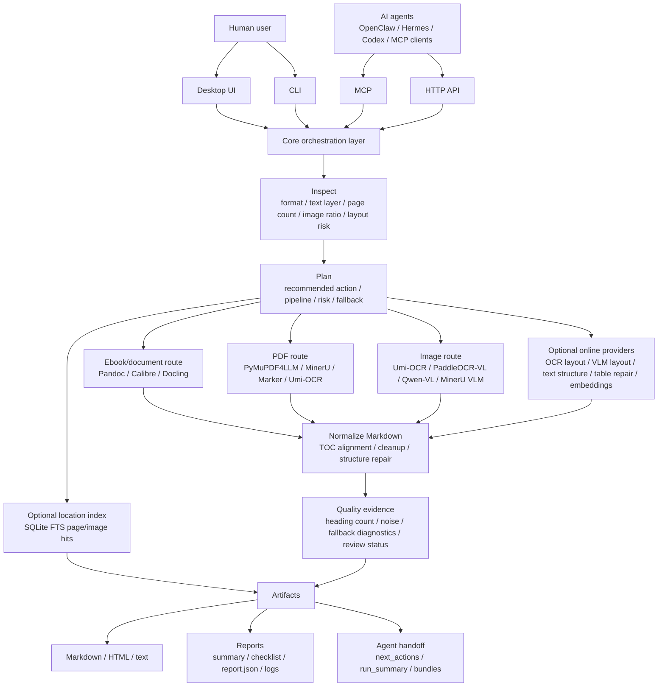

# Project Overview

## GitHub About Text

English:

> Local-first graphic/text material converter for ebooks, PDFs, Office files, images, screenshots, and web archives. It orchestrates Pandoc, Calibre, PyMuPDF4LLM, MinerU, Marker, Docling, Umi-OCR, and optional VLM/OCR providers into Markdown, reports, and agent-friendly artifacts.

中文：

> 本地优先的图文材料转换器，面向电子书、PDF、Office、图片、截图集和网页归档，复用 Pandoc、Calibre、PyMuPDF4LLM、MinerU、Marker、Docling、Umi-OCR 与可选 VLM/OCR 后端，输出 Markdown、质量报告和 Agent 可调用工件。

Suggested topics:

`ebook`, `pdf`, `ocr`, `markdown`, `document-ai`, `mcp`, `agent-tools`, `pandoc`, `calibre`, `mineru`, `docling`

## What This Repository Is

This repository is an orchestration and productization layer. It focuses on:

- input inspection and routing;
- safe fallback and timeout handling;
- Markdown normalization, TOC alignment, and structure repair;
- quality scoring, review checklists, logs, and reports;
- desktop UI, CLI, HTTP API, MCP tools, and agent handoff bundles.

It intentionally does not try to become a new PDF parser, OCR engine, ebook renderer, or vision-language model runtime.

## Architecture

For the detailed system diagram, PDF/image routing diagram, online provider boundary, and module map, see [ARCHITECTURE.md](ARCHITECTURE.md).

## Referenced And Reused Open-Source Tools

The project follows a tool-first integration principle: use mature tools directly, keep their ownership boundaries clear, and write glue code only where it improves reliability, observability, or agent usability.

| Tool / Project | How It Is Used | Boundary |
| --- | --- | --- |
| Pandoc | Common ebook/text/Markdown/HTML conversion | External command |
| Calibre / `ebook-convert` | AZW/AZW3/MOBI/RTF normalization before Markdown conversion | External command |
| PyMuPDF | PDF inspection, outline extraction, page rendering, text-layer checks | Python API |
| PyMuPDF4LLM | Fast text-layer PDF-to-Markdown fallback | Python package |
| MinerU | Optional structured PDF parsing for complex/scanned PDFs | Optional external backend |
| Marker | Optional layout-aware PDF parsing | Optional external backend |
| Docling | Optional Office/document/PDF structure backend | Optional Python package/backend |
| Umi-OCR / PaddleOCR-json | Local OCR blocks for images and scanned pages | External local OCR engine |
| PaddleOCR-VL | Optional layout-heavy image/infographic enhancement | Optional wrapper/backend |
| Qwen-VL | Optional heavier VLM fallback for difficult images | Optional wrapper/backend |

This repository does not vendor third-party binaries, model weights, datasets, or upstream parser/OCR/model source trees. For the detailed reuse and license boundary, see [REFERENCES_AND_REUSE.md](REFERENCES_AND_REUSE.md) and [../THIRD_PARTY_NOTICES.md](../THIRD_PARTY_NOTICES.md).

## Agent-Facing Contract

Agents should treat this project as a stable tool surface rather than guessing backend commands:

- Use `process_material` for normal recognition/conversion.
- Use `get_agent_contract` or `/contract` to inspect the available tool contract.
- Use `health_check` before choosing heavyweight OCR/PDF routes.
- Follow returned `next_actions` for reruns, structure enhancement, PDF comparison, and review.
- Use versioned outputs by default; do not overwrite earlier conversion results unless explicitly requested.

See [AGENT_INTEGRATION.md](AGENT_INTEGRATION.md) and [TOOL_CONTRACT.md](TOOL_CONTRACT.md) for the full contract.
