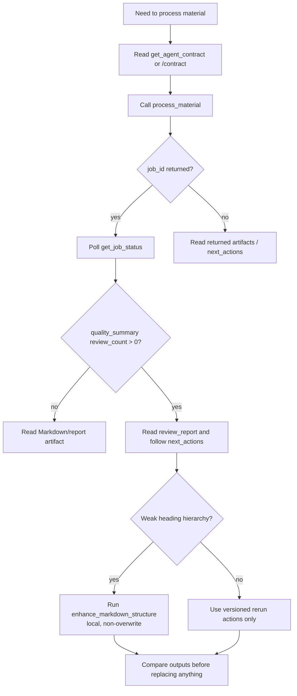

# Agent Recipes

These recipes are small, copyable playbooks for AI agents that need to call the Graphic-Text Material Converter safely.

Use them when you want a stable workflow rather than a full batch manifest. For larger repeatable batches, use `examples/agent-batch/`.

## Rules For All Recipes

- Start with `get_agent_contract` or HTTP `/contract` when the agent has not seen this project in the current session.
- Use `process_material` for unknown inputs.
- Poll `get_job_status` until the job is no longer `running`.
- Read `quality_summary` before telling the user the output is final.
- Follow `next_actions` with `tool` and `arguments`; do not invent paths from memory.
- Never overwrite outputs during automated review. Prefer versioned reruns with `output_name_suffix`.
- Use `intent=locate` or `query` only when the task is location indexing. Plain recognition/conversion is the default.

## Recipes

| Recipe | Use Case |
| --- | --- |
| [single-file-recognition.md](single-file-recognition.md) | Convert or recognize one ebook/PDF/image without location indexing. |
| [batch-folder.md](batch-folder.md) | Process a folder through `process_material` and inspect completion. |
| [rerun-failed-or-review.md](rerun-failed-or-review.md) | Recover failed/review/poor outputs using executable `next_actions`. |
| [structure-enhancement.md](structure-enhancement.md) | Safely repair weak Markdown heading hierarchy without overwriting the original output. |
| [review-checklist.md](review-checklist.md) | Read summaries, checklists, reports, and structure-repair evidence. |
| [docker-http-agent.md](docker-http-agent.md) | Call the Windows host HTTP bridge from Docker-based agents. |

## Minimal Decision Tree

